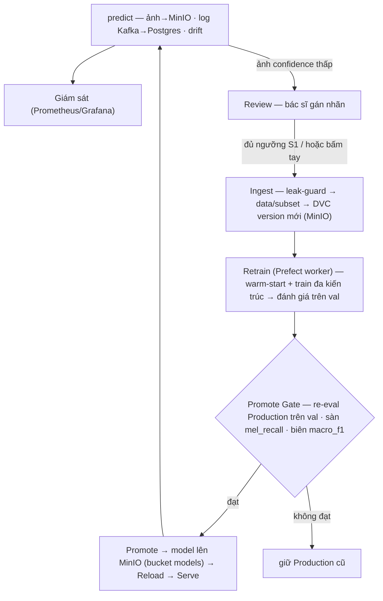

# DermaMLOps — Hệ thống MLOps phân loại tổn thương da

Hệ thống MLOps **đầu-cuối** cho bài toán phân loại tổn thương da từ ảnh dermoscopy (dataset **HAM10000**, 7 lớp). Đồ án tập trung vào **kiến trúc vòng đời ML** (serving → giám sát → thu thập nhãn → huấn luyện lại → duyệt → triển khai), trong đó **mô hình học sâu chỉ là một thành phần thay thế được**.

> 7 lớp: `akiec · bcc · bkl · df · mel · nv · vasc`. Đây là công cụ **hỗ trợ tham khảo**, không thay thế chẩn đoán của bác sĩ.

---

## 1. Tính năng chính

- **Serving + giải thích**: API `/predict` trả top-k + **Grad-CAM** (vùng model chú ý); model nạp **từ MinIO**.
- **Giám sát**: Prometheus + Grafana; phát hiện **drift** (chất lượng ảnh + PSI phân bố lớp) + tỉ lệ confidence thấp.
- **Human-in-the-loop**: hàng chờ **review** ảnh confidence thấp → bác sĩ gán nhãn.
- **Active-learning khép kín**: review → **ingest** (có **leak-guard** chống trùng val/test) → **DVC** version dữ liệu → **retrain**.
- **Huấn luyện lại có kiểm soát**: warm-start từ Production, train & so sánh nhiều kiến trúc, đánh giá trên tập `val` cố định.
- **Promote Gate**: re-eval Production trên `val` (so cùng nguồn) + **sàn an toàn** `melanoma_recall ≥ 0.40` + biên cải thiện — chỉ promote khi thực sự tốt hơn.
- **Tự động hoá**: 4 tín hiệu **S1–S4** (đủ review / drift / accuracy giảm / định kỳ) tự kích retrain; tự bỏ qua khi không có dữ liệu mới.
- **Trang Admin**: bảng điều khiển toàn bộ vòng đời (registry, train, gate, tín hiệu, lịch sử, cấu hình).
- **Đăng nhập + phân quyền**: JWT (bcrypt) + **RBAC** (`admin` / `doctor` / `nurse`); admin tự tạo & quản lý tài khoản.
- **Event-driven**: Kafka tách logging/giám sát khỏi luồng request (có fallback khi Kafka chết).

---

## 2. Công cụ & công nghệ

| Lớp | Công cụ |
|---|---|
| Serving API | **FastAPI** (Python) |
| Mô hình | **PyTorch / torchvision** (efficientnet_b0 · resnet50 · mobilenet_v3_large) |
| Giao diện | **Next.js** + React + Tailwind |
| CSDL | **PostgreSQL** (app + backend MLflow) |
| Object storage | **MinIO** (model · ảnh · DVC remote · MLflow artifacts) |
| Model Registry + tracking | **MLflow** |
| Điều phối | **Prefect** (server + worker) |
| Event streaming | **Kafka** (KRaft) |
| Data versioning | **DVC** |
| Giám sát | **Prometheus** + **Grafana** |
| Đóng gói | **Docker Compose** (12 service) · **GitHub Actions** (CI) |

Chi tiết kiến trúc + sơ đồ: [docs/ARCHITECTURE.md](docs/ARCHITECTURE.md) · Cơ chế DVC/Prefect/MLflow: [docs/giai-thich-he-thong-mlops.md](docs/giai-thich-he-thong-mlops.md).

---

## 3. Vòng đời MLOps (cốt lõi)



---

## 4. Hướng dẫn chạy

**Yêu cầu**: Docker + Docker Compose.

```bash
cd code
docker compose up --build        # khởi động 12 service
```

**Nạp model Production** (hệ thống serving model từ MinIO, không đọc file local):
- Huấn luyện bằng [notebooks/01_train_models.ipynb](notebooks/01_train_models.ipynb) (Kaggle/GPU) → ra `production.pt`.
- Đăng ký vào MLflow (tự đẩy lên MinIO + set Production) — xem [docs/giai-thich-he-thong-mlops.md](docs/giai-thich-he-thong-mlops.md).
- Hoặc dùng `POST /admin/seed-models` để seed model demo khi mới dựng.

**Truy cập**:

| Dịch vụ | URL | Ghi chú |
|---|---|---|
| Web (giao diện chính) | http://localhost:3100 | Đăng nhập rồi vào Dự đoán · Lịch sử · Cần review · Giám sát |
| Trang Admin | http://localhost:3100/admin | chỉ tài khoản role `admin` |
| API docs (Swagger) | http://localhost:8200/docs | |
| MLflow | http://localhost:5000 | registry + tracking |
| Prefect | http://localhost:4200 | orchestration |
| Grafana | http://localhost:3001 | dashboard |
| Prometheus | http://localhost:9090 | metrics |
| MinIO Console | http://localhost:9001 | `minioadmin` / `minioadmin` |
| PostgreSQL | `localhost:5434` | `skin` / `skin_pass` / `skinlesion` |

> Web gọi API qua proxy nội bộ (`/api/*` → `api:8000`); ảnh hiển thị qua proxy `/api/img/{id}` nên không cần mở cổng MinIO ra ngoài.

**Đăng nhập (JWT + RBAC)**: web yêu cầu đăng nhập; API bảo vệ bằng `Bearer` token. Hai tài khoản seed sẵn:

| Tài khoản | Mật khẩu | Role | Quyền |
|---|---|---|---|
| `admin` | `admin123` | `admin` | Toàn bộ, gồm trang Admin (control plane: promote, ingest, retrain) |
| `doctor` | `doctor123` | `doctor` | Dự đoán · Lịch sử · Cần review · Giám sát (không vào Admin) |

> Đổi mật khẩu/`JWT_SECRET` trước khi chạy thật. `/metrics` (Prometheus) và `/api/img/{id}` cố ý để public.

---

## 5. API chính

| Method | Endpoint | Mô tả | Bảo vệ |
|---|---|---|---|
| POST | `/auth/login` · GET `/auth/me` | Đăng nhập (trả JWT) · thông tin user | public · token |
| POST | `/predict` | Dự đoán + Grad-CAM (lưu ảnh MinIO, log Kafka→Postgres, tính drift) | token |
| GET | `/predictions` · `/predictions/{id}` | Lịch sử dự đoán | token |
| GET | `/predictions/{id}/image` | Ảnh gốc (cho thẻ ``) | public |
| GET | `/reviews/queue` · POST `/reviews` | Hàng chờ review · gửi nhãn | token |
| GET | `/monitoring/stats` | Thống kê | token |
| GET | `/metrics` | Metrics Prometheus | public |
| ALL | `/admin/*` | registry, retrain, gate, promote, ingest-reviews, reload-model, config, runs, **users** (CRUD tài khoản)… | role `admin` |

---

## 6. Cấu trúc thư mục

```
headloader/
├── code/
│   ├── backend/        # FastAPI: api + Kafka consumers + Prefect flows (dùng chung image)
│   │   └── app/        #   api/ · services/ · repositories/ · consumer/ · flows/ · db/ · core/
│   ├── frontend/       # Next.js (Dự đoán · Lịch sử · Review · Giám sát · Admin)
│   ├── mlflow/ · prefect/ · postgres/ · monitoring/   # Dockerfile/cấu hình từng service
│   ├── scripts/        # mô phỏng streaming + tạo ảnh drift
│   └── docker-compose.yml
├── docs/               # ARCHITECTURE · giai-thich-he-thong-mlops · plan · SECURITY · performance
├── notebooks/          # 01_train_models.ipynb (huấn luyện trên Kaggle/GPU)
├── data/               # *.dvc (con trỏ DVC); ảnh gitignored
└── tests/performance/  # k6 load test
```

---

## 7. Test & CI

```bash
cd code/backend && pip install -r requirements-dev.txt && pytest
```
- **Unit + integration** (pytest): promote gate · drift/PSI · config · 4 tín hiệu trigger · Kafka producer · API qua TestClient.
- **CI** (`.github/workflows/ci.yml`): chạy pytest + build frontend mỗi push/PR.

---

## 8. Tài liệu liên quan

| Tài liệu | Nội dung |
|---|---|
| [docs/ARCHITECTURE.md](docs/ARCHITECTURE.md) | Kiến trúc tổng, ERD, sequence, luồng tín hiệu |
| [docs/giai-thich-he-thong-mlops.md](docs/giai-thich-he-thong-mlops.md) | Cơ chế DVC · Prefect · MLflow · MinIO |
| [docs/SECURITY.md](docs/SECURITY.md) | Ghi chú bảo mật |
| [docs/performance/PERF-REPORT.md](docs/performance/PERF-REPORT.md) | Báo cáo hiệu năng (k6) |
| [docs/plan.md](docs/plan.md) | Kế hoạch & sơ đồ (mermaid) |

---

## 9. Giới hạn đã biết (trung thực)

- Suy luận chạy **CPU** trong stack → model train trong hệ (chế độ smoke) chỉ để **demo vòng lặp**; model mạnh nên huấn luyện trên **Kaggle/GPU** rồi nạp vào.
- Bảo mật **demo-grade**: đã có JWT + RBAC + bcrypt, nhưng còn mật khẩu mặc định, chưa TLS/refresh-token/pentest.
- HA: Postgres/MinIO/Kafka còn **single-node**.
- "Drift" gồm heuristic chất lượng ảnh + PSI phân bố lớp (chưa drift trên embedding đầy đủ); tín hiệu S3 đo trên ảnh đã review nên thiên về ca khó.
- CD (deploy tự động) chưa làm — đánh dấu hướng phát triển.
