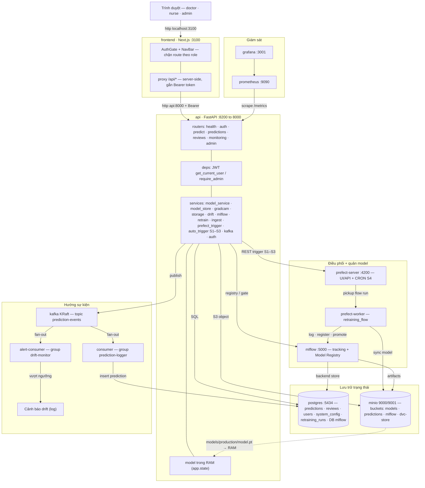
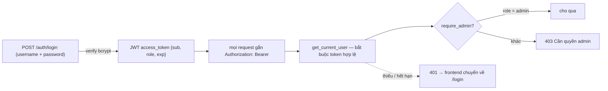
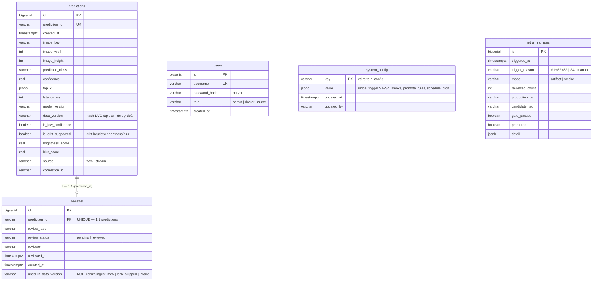
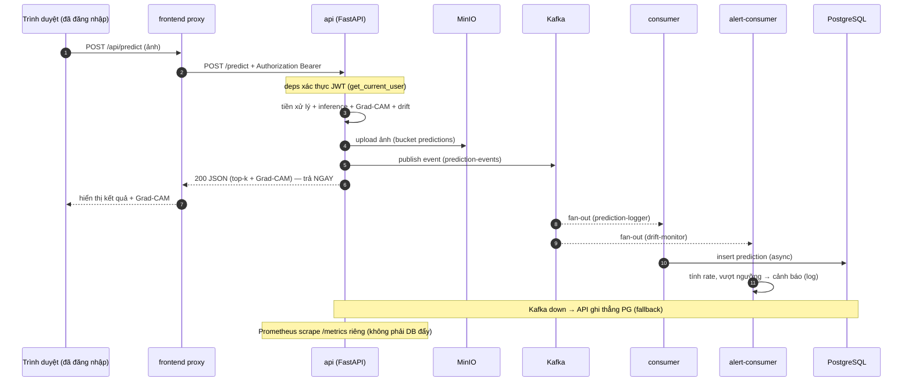
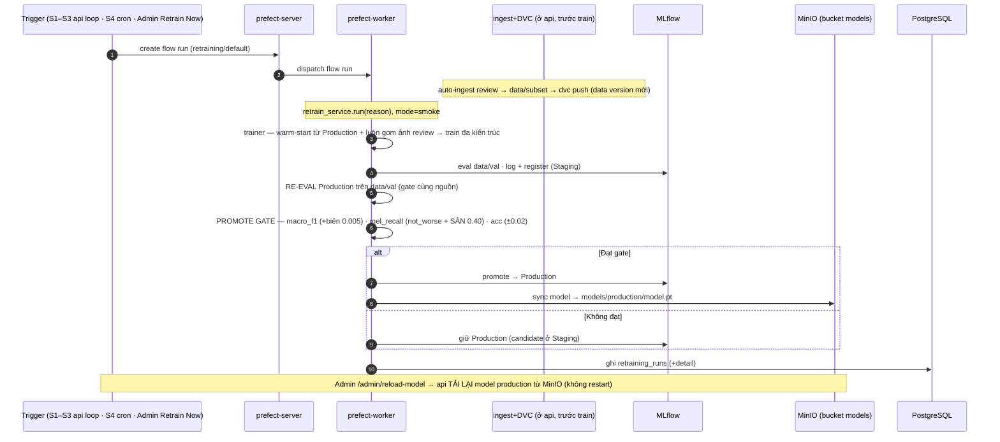
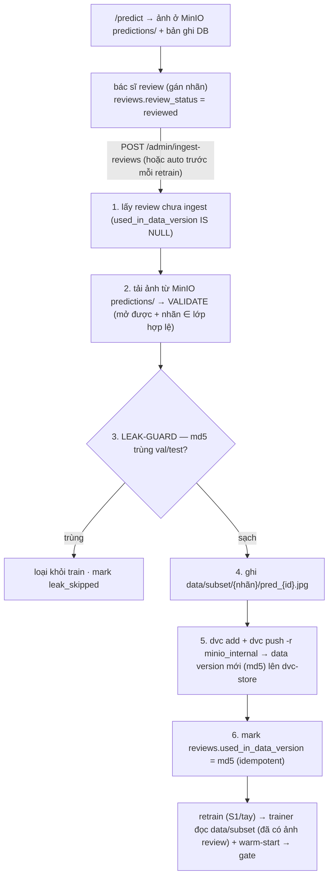
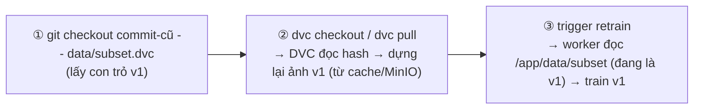
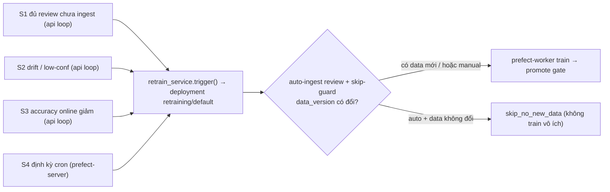

# Kiến trúc hệ thống — Skin Lesion MLOps

> Tài liệu kiến trúc để đưa vào báo cáo đồ án. Mọi thành phần/port/luồng đều bám đúng hệ thống đang chạy (`docker compose`, 12 service). Bổ trợ: [README](../README.md) (chạy/cấu trúc), [plan.md](plan.md) (kế hoạch), [giai-thich-he-thong-mlops.md](giai-thich-he-thong-mlops.md) (cơ chế DVC/Prefect/MLflow), [SECURITY.md](SECURITY.md), [performance/PERF-REPORT.md](performance/PERF-REPORT.md).

## 1. Tổng quan

Hệ thống MLOps phân loại tổn thương da từ ảnh dermoscopy (HAM10000). Trọng tâm là **kiến trúc vòng đời ML** (data versioning → serving → monitoring → registry → orchestration → retraining), mô hình học sâu chỉ là một thành phần thay thế được. Tự định vị **MLOps Maturity Level 1 đầy đủ + hiện thực cơ chế Level 2** (retraining tự động hướng sự kiện + theo lịch, promote gate).

**Nguyên tắc thiết kế:** tách trách nhiệm rõ (serving / lưu trữ / điều phối / quản model), hướng sự kiện (Kafka), đóng gói container (Docker Compose), mọi tham số cấu hình được (DB `system_config` + `.env`), truy cập có xác thực (JWT) + phân quyền (RBAC).

## 2. Sơ đồ kiến trúc tổng (12 service)

**Cổng host:** frontend 3100 · api 8200 · postgres 5434 · minio 9000/9001 · prometheus 9090 · grafana 3001 · mlflow 5000 · prefect-server 4200. (kafka, consumer, alert-consumer, prefect-worker: không expose cổng.)

## 3. Trách nhiệm từng thành phần

| Service | Trách nhiệm | Trục |
|---|---|---|
| `frontend` | UI Next.js + proxy `/api/*` (không CORS, ẩn URL API); `AuthGate` chặn route khi chưa đăng nhập, ẩn link Admin theo role | giao diện |
| `api` | Serving `/predict` + Grad-CAM (model tải từ MinIO); xác thực JWT + RBAC; REST admin; **active-learning ingest** (review→`data/subset`+`dvc add/push`); đánh giá tín hiệu S1–S3; producer Kafka | serving + control |
| `postgres` | `predictions/reviews/users/system_config/retraining_runs` + **MLflow backend store** | trạng thái bền |
| `minio` | Object storage 4 bucket: `models` (**model serving**: production/staging/archive) · `predictions` (ảnh) · `mlflow` (artifacts) · `dvc-store` (DVC remote cho data) | lưu file |
| `kafka` | Message broker (KRaft) — topic `prediction-events` | đường ống sự kiện |
| `consumer` | Group `prediction-logger`: event → ghi `predictions` (async) | logging |
| `alert-consumer` | Group `drift-monitor`: event → cảnh báo drift real-time (fan-out) | monitoring |
| `mlflow` | Tracking + Model Registry + promote gate (backend Postgres) | quản model |
| `prefect-server` | Orchestration: UI/API + lịch cron (tín hiệu S4) | điều phối (lịch) |
| `prefect-worker` | Thực thi `retraining_flow`: smoke train thật (**warm-start từ Production** + luôn gom ảnh review) → **re-eval Production trên data/val** → gate → promote | điều phối (chạy) |
| `prometheus` | Thu thập metrics (scrape `api:/metrics`) | giám sát |
| `grafana` | Dashboard giám sát | giám sát |

## 3A. Xác thực & phân quyền (JWT + RBAC)

Truy cập có **đăng nhập** (JWT `Bearer`, HS256) + **phân quyền theo vai trò** (RBAC). Mật khẩu băm **bcrypt**; người dùng lưu ở bảng `users`; cấu hình `JWT_SECRET` / `JWT_EXPIRE_MINUTES` (mặc định 480 phút) qua biến môi trường.

| Vai trò | Quyền |
|---|---|
| `admin` | Toàn bộ — gồm trang Admin (control plane: promote, ingest, retrain, config) **và quản lý người dùng** |
| `doctor` | Trang lâm sàng: Dự đoán · Lịch sử · Cần review · Giám sát |
| `nurse` | Như `doctor` (lâm sàng), không vào Admin |

**Mức bảo vệ từng endpoint** (đăng ký ở [`api/main.py`](../code/backend/app/api/main.py) + per-router):

| Nhóm endpoint | Bảo vệ |
|---|---|
| `/health` · `/metrics` (Prometheus) · `GET /predictions/{id}/image` | **public** (cố ý — health-check, scrape, hiển thị ảnh qua thẻ ``) |
| `POST /auth/login` | public · `GET /auth/me` cần token |
| `/predict` · `/reviews*` · `GET /predictions` · `GET /predictions/{id}` · `/monitoring/stats` | cần token (mọi role) |
| `/admin/*` (gồm `/admin/users*`) | cần role **admin** (`require_admin`) |

> Hai tài khoản seed sẵn khi khởi động: `admin/admin123` (admin) và `doctor/doctor123` (doctor). Admin tạo thêm bác sĩ/y tá qua **Quản lý người dùng** (`/admin/users`: list/create/đổi mật khẩu/xoá; chốt: không tự xoá mình, không xoá admin cuối cùng). Đây vẫn là **demo-grade** (mật khẩu mặc định, chưa TLS) — xem [SECURITY.md](SECURITY.md).

## 4. Mô hình dữ liệu (ERD)

Database `skinlesion` (app) — 5 bảng:

- **predictions 1—1 reviews**: mỗi prediction có tối đa 1 review (FK + UNIQUE). Bảng tách: predictions bất biến (log), reviews là annotation của bác sĩ.
- **users**: tài khoản đăng nhập + vai trò (RBAC) — không có FK cứng tới predictions/reviews (`reviewer` chỉ lưu username dạng text).
- **Quan hệ logic (không FK cứng)**: `model_version`/`data_version` ↔ MLflow registry + DVC hash (governance).

Database `mlflow` (Postgres riêng) — do MLflow tự quản: `experiments`, `runs`, `registered_models`, `model_versions`, `model_version_tags`… (registry + tracking).

## 5. Sequence — Dự đoán (event-driven qua Kafka)

## 6. Sequence — Retraining (Prefect → gate → promote)

> Triết lý 2 tầng: **TRIGGER** (có nên thử) tách **PROMOTE GATE** (có đủ tốt để thay). Trigger rộng tay cũng an toàn vì gate luôn chặn model kém.

## 7. Active-learning — review → ingest → data version mới

> Bấm nút là **thủ công**; ngoài ra **mọi retrain (S1–S4/tay) tự gọi ingest này trước khi train** (xem §9) — nút chỉ để ingest sớm/độc lập.
> DVC chạy **ngay trong container api** (`dvc[s3]`, `core.no_scm=true`, remote nội bộ `minio_internal` → `minio:9000`).
> Vòng human-in-the-loop khép kín: **chỉ** ảnh bác sĩ đã duyệt **và** không trùng holdout (val/test) mới vào tập train.

## 8. Sequence — Rollback data version (DVC)

DVC (không phải Prefect) kéo data từ MinIO theo con trỏ; Prefect chỉ chạy code sau khi data đã có trên đĩa.

## 9. Luồng tín hiệu retraining (S1–S4)

| Mã | Tín hiệu | Service đánh giá | Nguồn dữ liệu |
|---|---|---|---|
| S1 | đủ **ảnh review CHƯA ingest** | `api` (loop) | `reviews` (`used_in_data_version IS NULL` ≥ ngưỡng) |
| S2 | drift / confidence thấp | `api` (loop) | `predictions` (cờ drift/low-conf) |
| S3 | hiệu năng online giảm | `api` (loop) | `reviews`+`predictions` (accuracy) |
| S4 | định kỳ | `prefect-server` (cron) | lịch `schedule_cron` |

S1–S3 event-driven (api → gọi Prefect REST); S4 = Prefect cron tự bắn. Tất cả hội tụ về deployment `retraining/default`, worker thực thi.

**Khép kín active-learning (mọi tín hiệu đi qua `retrain_service.trigger()` ở api):**
1. **Auto-ingest**: trước khi train, tự đưa review đang chờ (`used_in_data_version IS NULL`) vào `data/subset` + `dvc push` → train luôn trên data mới nhất. *(Ingest chạy ở `api` vì worker mount `data:ro` + không có dvc; worker đọc cùng folder host nên thấy ngay.)*
2. **Skip-guard**: nếu tín hiệu **tự động** mà **data không đổi** (`data_version` == lần train trước) → **bỏ qua** (ghi `skip_no_new_data`, không train vô ích). `manual` (Retrain Now) thì luôn train.
> Nhờ vậy S2/S3/S4 chỉ thực sự train khi **có dữ liệu review mới** (vd ảnh gây drift đã được duyệt); không có gì mới thì chỉ đóng vai "chuông báo".

## 10. Quyết định thiết kế & đánh đổi (tóm tắt)

| Quyết định | Lý do | Đánh đổi |
|---|---|---|
| Hướng sự kiện (Kafka) | tách serving khỏi logging; fan-out nhiều consumer | log eventual-consistency dưới giây; thêm broker |
| Prefect tách server/worker | hết xung đột dependency; tách lịch vs thực thi | thêm container |
| MLflow backend PostgreSQL | bỏ SPOF SQLite | phụ thuộc Postgres |
| DVC version **data** → MinIO `dvc-store` | reproducibility + data lineage | model dùng `models` bucket riêng (không qua DVC) |
| Ingest tự `dvc add/push` (active-learning) | review→train khép kín, không gõ tay | `dvc add` băm lại cả tập mỗi lần (chậm khi data lớn) |
| Serving nạp model **từ MinIO** (`models/production/model.pt`) | nguồn chân lý tập trung, deploy máy khác chỉ cần MinIO | tải 1 lần vào RAM lúc startup/reload |
| DVC chạy trong container (`no_scm`) | ingest tự `dvc add/push`, không cần thao tác host | hack nhẹ (bỏ tích hợp git của DVC) |
| Auth **JWT + RBAC** (admin/doctor/nurse), mật khẩu **bcrypt** | có user/role thật, admin tự quản tài khoản; thay cho 1 token tĩnh | vẫn demo-grade: mật khẩu mặc định, chưa TLS/refresh-token/pentest (xem SECURITY.md) |

## 11. Giới hạn đã biết (trung thực)

- `/predict` không scale theo concurrency (inference CPU tuần tự) — đo trong [PERF-REPORT](performance/PERF-REPORT.md), có lộ trình tối ưu.
- Bảo mật demo-grade: **đã có** JWT + RBAC + bcrypt, nhưng **chưa** TLS/HTTPS, chưa refresh-token/rotation, mật khẩu mặc định, chưa pentest — xem [SECURITY.md](SECURITY.md).
- HA: mới bỏ SPOF MLflow; Postgres/MinIO/Kafka còn single-node.
- "Drift" gồm heuristic chất lượng ảnh (brightness/blur) + PSI phân bố lớp (chưa drift trên embedding/feature đầy đủ).
- **S3 (online accuracy) đo trên ảnh đã review** (vốn là ảnh low-conf) → thiên lệch về phía khó; chưa có tập audit ngẫu nhiên.
- Confidence chưa calibrate; `dvc pull` trước train chưa nối (chạy 1 máy nên data luôn sẵn) — chỉ cần khi train máy khác.
- CD (deploy tự động) chưa làm (đánh dấu hướng phát triển).

> **Đã siết (so với bản đầu):** gate **re-eval Production trên data/val** (so cùng nguồn) + **sàn `mel_recall ≥ 0.40`** + **biên macro_f1 0.005** (chống nhiễu); ingest có **leak-guard** (md5 vs val/test); retrain **warm-start** + luôn gom ảnh review; truy cập có **JWT + RBAC**.
