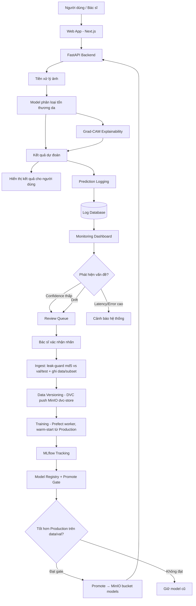
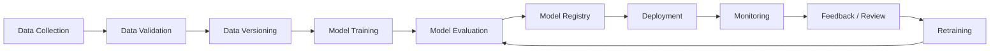
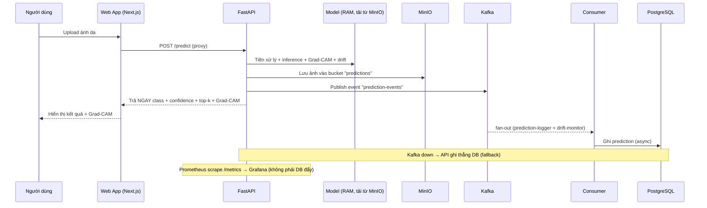
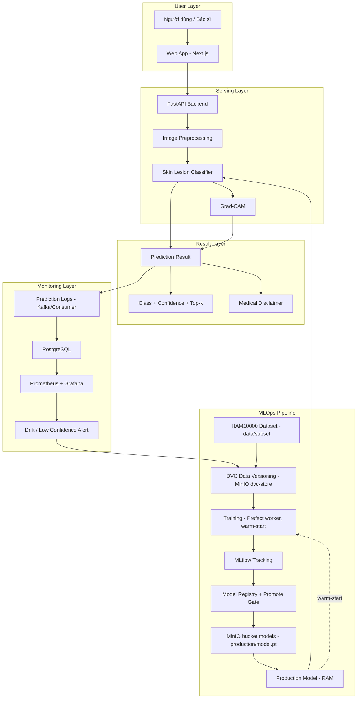

# Kế hoạch đồ án tốt nghiệp

# Xây dựng hệ thống MLOps hỗ trợ phân loại tổn thương da từ ảnh dermoscopy

> Phiên bản đề xuất: MVP khả thi cho đồ án tốt nghiệp  
> Trọng tâm: **Kiến trúc hệ thống MLOps** (hướng sự kiện, phân lớp, đóng gói container) — mô hình học sâu là một thành phần có thể thay thế, không phải trọng tâm. Không phải hệ thống chẩn đoán y tế thay bác sĩ.  
> Dataset chính đề xuất: HAM10000 / ISIC  
> Model đề xuất: EfficientNet-B0 hoặc ResNet50  
> Giao diện: Next.js + React + Tailwind  
> Backend: FastAPI  
> Object storage: MinIO (S3) — lưu ảnh prediction + DVC remote + MLflow artifacts  
> MLOps: DVC + MLflow + Prefect (orchestration) + Docker Compose  
> Streaming & Monitoring: Kafka (prediction event stream) + Prometheus + Grafana  
> Retraining: tự động hoá bằng Prefect (trigger theo drift / lịch)  

> **ĐIỀU CHỈNH SO VỚI BẢN GỐC (đã triển khai thực tế):** chỉ dùng **Next.js** cho frontend (đã bỏ Streamlit); **MLflow backend = PostgreSQL** (không phải SQLite); mã nguồn theo cấu trúc `code/backend` + `code/frontend` (xem README); deploy **12 service** gồm `prefect-server`/`prefect-worker` tách riêng và **2 Kafka consumer** (`consumer` ghi DB + `alert-consumer` cảnh báo drift). Cấu trúc thư mục thực tế xem [README](../README.md); các "tình trạng hiện thực" được ghi chú trong từng mục liên quan.

---

## 1. Giới thiệu đề tài

Các bệnh về da, đặc biệt là các tổn thương da có nguy cơ ung thư da, cần được phát hiện và theo dõi sớm. Trong những năm gần đây, các mô hình học sâu đã được ứng dụng nhiều trong bài toán phân loại ảnh da. Tuy nhiên, việc xây dựng một mô hình AI đơn lẻ chưa đủ để đưa vào sử dụng thực tế. Một hệ thống AI cần có khả năng quản lý dữ liệu, quản lý mô hình, theo dõi quá trình huấn luyện, triển khai, giám sát sau triển khai và tái huấn luyện khi dữ liệu thay đổi.

Vì vậy, đề tài này tập trung xây dựng một hệ thống MLOps hỗ trợ phân loại tổn thương da từ ảnh dermoscopy. Hệ thống cho phép người dùng upload ảnh, mô hình đưa ra dự đoán kèm độ tin cậy, hiển thị Grad-CAM để giải thích vùng ảnh mô hình chú ý, đồng thời ghi log phục vụ monitoring. Khi phát hiện ảnh có độ tin cậy thấp hoặc dấu hiệu dữ liệu đầu vào bị thay đổi, hệ thống đưa ảnh vào hàng chờ review và có thể kích hoạt pipeline retraining.

---

## 2. Tên đề tài đề xuất

Có thể chọn một trong các tên sau:

### Tên ngắn gọn

**Xây dựng hệ thống MLOps hỗ trợ phân loại tổn thương da từ ảnh dermoscopy**

### Tên đầy đủ hơn

**Xây dựng hệ thống MLOps hỗ trợ phân loại tổn thương da từ ảnh dermoscopy, tích hợp giải thích mô hình, giám sát suy luận và tái huấn luyện**

### Tên theo hướng báo cáo khoa học

**An MLOps Pipeline for Skin Lesion Classification Using Dermoscopic Images with Model Monitoring and Retraining**

---

## 3. Bối cảnh và lý do chọn đề tài

### 3.1. Vấn đề thực tế

Trong các bài toán y tế, đặc biệt là ảnh da liễu, mô hình AI thường gặp các vấn đề:

- Dữ liệu bị mất cân bằng giữa các lớp bệnh.
- Ảnh có chất lượng khác nhau.
- Dữ liệu huấn luyện và dữ liệu thực tế có thể khác phân phối.
- Model đạt kết quả tốt trên tập test nhưng giảm hiệu năng khi gặp dữ liệu mới.
- Không có cơ chế theo dõi model sau khi triển khai.
- Không có quy trình rõ ràng để cập nhật dữ liệu và huấn luyện lại model.

Do đó, thay vì chỉ xây dựng một mô hình phân loại ảnh, đề tài tập trung vào toàn bộ vòng đời MLOps.

### 3.2. Vì sao cần MLOps?

MLOps giúp hệ thống machine learning có thể:

- Quản lý version dữ liệu.
- Theo dõi quá trình training.
- Lưu lại metric, tham số, artifact.
- Quản lý version model.
- Triển khai model có kiểm soát.
- Theo dõi hiệu năng suy luận sau deploy.
- Phát hiện dữ liệu bất thường hoặc drift.
- Tái huấn luyện khi có dữ liệu mới.
- So sánh model cũ và model mới trước khi đưa vào production.

---

## 4. Mục tiêu đề tài

### 4.1. Mục tiêu tổng quát

Xây dựng một hệ thống MLOps hoàn chỉnh cho bài toán phân loại tổn thương da từ ảnh dermoscopy, bao gồm các bước từ quản lý dữ liệu, huấn luyện mô hình, tracking, registry, triển khai, monitoring đến retraining.

### 4.2. Mục tiêu cụ thể

Hệ thống cần đạt các mục tiêu:

1. Thu thập và tổ chức dataset ảnh da.
2. Tiền xử lý ảnh và chia train/validation/test.
3. Quản lý version dữ liệu bằng DVC.
4. Huấn luyện mô hình phân loại ảnh da bằng PyTorch.
5. Theo dõi experiment bằng MLflow.
6. Đánh giá model bằng nhiều metric phù hợp.
7. Lưu model tốt nhất vào MLflow Model Registry.
8. Deploy model bằng FastAPI.
9. Xây dựng giao diện upload ảnh bằng Next.js.
10. Trả về kết quả gồm:
    - Lớp dự đoán.
    - Độ tin cậy.
    - Top-k dự đoán.
    - Grad-CAM.
    - Cảnh báo y tế.
11. Ghi log prediction sau mỗi request.
12. Xây dựng monitoring dashboard.
13. Mô phỏng data drift bằng ảnh blur, ảnh tối, ảnh nhiễu.
14. Thiết kế cơ chế review queue cho ảnh confidence thấp.
15. Tạo data version mới và retrain model.
16. So sánh model cũ và model mới trước khi promote.

---

## 5. Phạm vi đề tài

### 5.1. Phạm vi nên làm trong đồ án

Đề tài nên tập trung vào:

- Ảnh dermoscopy.
- Phân loại tổn thương da.
- Dataset công khai HAM10000 / ISIC.
- MLOps lifecycle.
- Deploy local hoặc Docker Compose.
- Monitoring bằng log, Prometheus/Grafana hoặc dashboard đơn giản.
- Retraining mô phỏng.

### 5.2. Những phần không nên ôm quá rộng

Không nên đặt mục tiêu ban đầu là:

- Chẩn đoán mọi bệnh da từ ảnh điện thoại.
- Thay thế bác sĩ.
- Tích hợp bệnh án điện tử thật.
- Lấy dữ liệu bệnh nhân thật.
- Triển khai Kubernetes phức tạp.
- Làm RAG y khoa chuyên sâu ngay từ đầu.
- Làm mobile app hoàn chỉnh.
- Làm streaming video realtime như sản phẩm thương mại.

### 5.3. Câu giới hạn phạm vi nên ghi trong báo cáo

> Hệ thống trong phạm vi đồ án chỉ hỗ trợ phân loại tổn thương da từ ảnh dermoscopy và chỉ mang tính tham khảo. Kết quả của hệ thống không thay thế chẩn đoán của bác sĩ chuyên khoa da liễu.

---

## 6. Giải pháp đề xuất

Giải pháp đề xuất là xây dựng một pipeline MLOps gồm hai phần chính:

### 6.1. Phần model serving

Người dùng upload ảnh qua giao diện web (Next.js). Backend FastAPI nhận ảnh, tiền xử lý và gọi model phân loại. Model trả về lớp dự đoán, confidence, top-k class và Grad-CAM. Kết quả được hiển thị cho người dùng kèm cảnh báo y tế.

### 6.2. Phần MLOps lifecycle

Dữ liệu được quản lý version bằng DVC. Quá trình training được tracking bằng MLflow. Model tốt nhất được đưa vào MLflow Model Registry. Sau khi deploy, hệ thống ghi log prediction, confidence, latency và phân phối lớp dự đoán. Nếu có nhiều ảnh confidence thấp hoặc dữ liệu đầu vào bị drift, hệ thống đưa ảnh vào review queue và tạo data version mới để retrain.

---

## 7. Dataset

## 7.1. Dataset chính: HAM10000 / ISIC

Dataset chính đề xuất là HAM10000, một bộ dữ liệu gồm 10.015 ảnh dermoscopy được phát hành công khai cho mục đích machine learning học thuật thông qua ISIC Archive.

Nguồn tham khảo:

- HAM10000 paper: https://www.nature.com/articles/sdata2018161
- ISIC Archive: https://www.isic-archive.com/
- PubMed HAM10000: https://pubmed.ncbi.nlm.nih.gov/30106392/

### 7.1.1. Vì sao chọn HAM10000?

HAM10000 phù hợp với đồ án vì:

- Có nguồn gốc học thuật rõ ràng.
- Được sử dụng phổ biến trong nghiên cứu phân loại tổn thương da.
- Có ảnh và nhãn tương đối rõ.
- Có metadata.
- Phù hợp với bài toán classification.
- Dễ xây dựng baseline model.
- Dễ chia train/validation/test.
- Dễ chứng minh MLOps lifecycle.

### 7.1.2. Các lớp bệnh trong HAM10000

Các lớp thường dùng:

| Ký hiệu | Tên đầy đủ | Diễn giải ngắn |
|---|---|---|
| nv | Melanocytic nevi | Nốt ruồi sắc tố |
| mel | Melanoma | U hắc tố |
| bkl | Benign keratosis-like lesions | Tổn thương dạng dày sừng lành tính |
| bcc | Basal cell carcinoma | Ung thư biểu mô tế bào đáy |
| akiec | Actinic keratoses / intraepithelial carcinoma | Dày sừng ánh sáng / tổn thương tiền ung thư |
| vasc | Vascular lesions | Tổn thương mạch máu |
| df | Dermatofibroma | U xơ da |

### 7.1.3. Hạn chế của HAM10000

Cần ghi rõ:

- Chủ yếu là ảnh dermoscopy, không phải ảnh điện thoại thông thường.
- Dữ liệu mất cân bằng lớp.
- Không đại diện đầy đủ cho mọi loại bệnh da.
- Không đủ để dùng trực tiếp cho sản phẩm y tế thật.
- Kết quả chỉ nên xem là hỗ trợ tham khảo.

---

## 7.2. Dataset phụ: PAD-UFES-20

PAD-UFES-20 có thể dùng làm external test set hoặc mô phỏng domain drift. Dataset này gồm 2.298 mẫu tổn thương da, có ảnh lâm sàng và thông tin lâm sàng đi kèm.

Nguồn tham khảo:

- Paper: https://pmc.ncbi.nlm.nih.gov/articles/PMC7479321/
- Mendeley Data: https://data.mendeley.com/datasets/zr7vgbcyr2/1
- ISIC collection: https://api.isic-archive.com/collections/406/

### 7.2.1. Cách dùng PAD-UFES-20

Không nên dùng PAD-UFES-20 làm dataset chính ngay từ đầu. Nên dùng như:

- External test set.
- Dữ liệu khác nguồn để kiểm tra domain shift.
- Dữ liệu mô phỏng drift.
- Hướng mở rộng cho multimodal model.

---

## 7.3. Chiến lược chia data

Đề xuất chia:

```text
train: 70%
validation: 15%
test: 15%
```

Hoặc:

```text
train: 80%
validation: 10%
test: 10%
```

Nên chia theo `lesion_id` nếu metadata cho phép, để tránh ảnh của cùng một tổn thương xuất hiện cả train và test.

### 7.3.1. Các tập dữ liệu cần tạo

```text
data/
  raw/
    ham10000/
      images/
      metadata.csv

  interim/
    ham10000_cleaned.csv

  processed/
    v1/
      train/
      val/
      test/
      labels.csv

    v2_augmented/
      train/
      val/
      test/
      labels.csv

  simulation/
    stream_normal/
    stream_low_confidence/
    stream_drift_brightness/
    stream_drift_blur/
    stream_drift_noise/
    stream_external/
```

---

## 7.4. Metadata cần lưu

File `labels.csv` nên có các cột:

```text
image_id
image_path
label
split
source
data_version
lesion_id
age
sex
localization
```

Nếu có review sau deploy:

```text
review_label
review_status
reviewer
review_time
```

---

## 7.5. Data versioning

DVC dùng để quản lý các phiên bản dữ liệu.

Ví dụ:

| Data version | Mô tả |
|---|---|
| data_v1 | Resize ảnh 224x224, split cơ bản |
| data_v2 | Thêm augmentation và xử lý class imbalance |
| data_v3 | Thêm dữ liệu confidence thấp đã review |
| data_v4 | Thêm external data hoặc drift data đã gán nhãn |

### 7.5.1. Mục tiêu của data versioning

- Biết model nào được train trên data nào.
- Có thể tái lập experiment.
- So sánh model theo từng data version.
- Dễ rollback nếu data mới làm model kém hơn.

Nguồn tham khảo DVC: https://dvc.org/

---

## 8. Công nghệ sử dụng

## 8.1. Ngôn ngữ và thư viện AI

| Thành phần | Công nghệ đề xuất |
|---|---|
| Ngôn ngữ | Python |
| Deep learning | PyTorch |
| Model pretrained | torchvision / timm |
| Xử lý ảnh | OpenCV, Pillow, torchvision transforms |
| Metrics | scikit-learn |
| Explainability | Grad-CAM |

---

## 8.2. MLOps

| Thành phần | Công nghệ |
|---|---|
| Data versioning | DVC (remote backend: MinIO / S3) |
| Experiment tracking | MLflow Tracking |
| Model registry | MLflow Model Registry |
| Pipeline (định nghĩa stage) | DVC pipeline |
| Orchestration (schedule / trigger / retry) | **Prefect** — điều phối training & retraining loop |
| Object storage | **MinIO** (S3-compatible) — ảnh prediction + DVC remote + MLflow artifacts |
| Message streaming | **Kafka** — luồng prediction event → consumer ghi log + monitoring |
| Container | Docker |
| Local orchestration | Docker Compose |
| Source control | Git + GitHub |

### Vai trò 3 thành phần hạ tầng cốt lõi

- **MinIO** = "ổ cứng đám mây" của hệ thống. Hợp nhất 3 nơi lưu trữ vào một object store: (1) ảnh người dùng upload tại `/predict` (giữ lại cho review queue / retrain), (2) DVC remote (push data version), (3) MLflow artifact store (model, plot). Prediction log chỉ lưu **object key**, không lưu ảnh nhị phân vào DB.
- **Prefect** = "bộ não điều phối". Gói các bước prepare → train → evaluate → promote thành flow; lên lịch, retry khi lỗi, và **tự kích hoạt retraining** khi nhận tín hiệu drift. Đây là thứ đưa retraining từ thủ công → tự động.
- **Kafka** = "đường ống sự kiện". Mỗi `/predict` bắn một event vào topic `prediction-events`; consumer đọc liên tục để ghi log, cập nhật metric và tính drift — tách rời serving khỏi monitoring.

Nguồn tham khảo:

- MLflow docs: https://mlflow.org/docs/latest/
- MLflow Model Registry: https://mlflow.org/docs/latest/ml/model-registry/
- DVC: https://dvc.org/
- Prefect: https://docs.prefect.io/
- MinIO: https://min.io/docs/minio/linux/index.html
- Kafka: https://kafka.apache.org/documentation/

---

## 8.3. Backend và frontend

| Thành phần | Công nghệ |
|---|---|
| Backend API | FastAPI |
| Frontend | Next.js + React + TailwindCSS (gọi API qua proxy route handler) |
| API test | Postman / curl / Python requests |
| File upload | Multipart form-data |
| Response | JSON + ảnh Grad-CAM |

---

## 8.4. Monitoring

Monitoring theo kiến trúc **event-driven**, Kafka là trục chính:

```text
/predict → bắn event vào Kafka topic `prediction-events`
        → consumer đọc liên tục:
              ├─ ghi prediction log vào PostgreSQL
              ├─ cập nhật metrics cho Prometheus
              └─ tính drift (confidence, brightness, class distribution)
        → Grafana hiển thị dashboard
        → Alert khi confidence thấp / drift vượt ngưỡng
```

Thành phần:

- **Kafka**: hàng đợi sự kiện prediction, tách serving khỏi xử lý log/metric.
- **PostgreSQL**: lưu prediction logs (bền vững, query được).
- **Prometheus**: thu thập & lưu metrics dạng time-series.
- **Grafana**: dashboard + alert rule.

> **TÌNH TRẠNG HIỆN THỰC (đã làm — Phase 4):** Kafka **ĐÃ được hiện thực** (KRaft, không Zookeeper). `/predict` làm inference + Grad-CAM + upload ảnh, rồi **bắn event vào topic `prediction-events`** (`services/kafka_service.py`) thay vì ghi DB trực tiếp; service **`consumer`** (`app/consumer/prediction_consumer.py`) đọc topic và ghi PostgreSQL bất đồng bộ → **tách serving khỏi logging**. Có **fallback**: nếu Kafka down, api ghi thẳng DB (không mất dữ liệu) — đã verify. Đánh đổi (đúng như dự kiến): độ trễ ghi log end-to-end cao hơn (eventual consistency dưới giây). Metrics Prometheus + drift scoring vẫn ở api (cần cho response + counter).

---

## 8.5. RAG / LLM

Không nên đưa RAG thành phần bắt buộc trong MVP. Nếu có thời gian, chỉ nên làm mức tham khảo:

- Tìm thông tin mô tả bệnh được dự đoán.
- Hiển thị dấu hiệu thường gặp.
- Hiển thị khuyến nghị đi khám.
- Không đưa ra đơn thuốc.
- Không khẳng định chẩn đoán.

Tên module nếu thêm:

```text
Medical Reference Assistant
```

Không nên gọi là “AI doctor”.

---

## 9. Kiến trúc hệ thống

## 9.1. Kiến trúc tổng thể



---

## 9.2. MLOps cycle



---

## 9.3. Runtime sequence khi người dùng upload ảnh



---

## 9.4. Kiến trúc theo layer



---

## 9.5. Hạ tầng triển khai (Deployment stack — Docker Compose)

Toàn bộ hệ thống chạy bằng một `docker-compose.yml`, gồm các service:

> Bảng dưới là **hiện thực thực tế** (12 service, port host). Khác bản gợi ý ban đầu: chỉ dùng **Next.js** (đã bỏ Streamlit), tách `prefect-server`/`prefect-worker`, có thêm `alert-consumer`, MLflow backend là PostgreSQL.

| Service | Vai trò | Port host |
|---|---|---|
| `frontend` | Next.js + React + Tailwind (giao diện chính, proxy `/api/*`) | 3100 |
| `api` | FastAPI — `/predict`, `/health`, `/reviews`, `/monitoring`, `/admin` | 8200 |
| `consumer` | Kafka consumer (group `prediction-logger`) — ghi prediction → Postgres | — |
| `alert-consumer` | Kafka consumer (group `drift-monitor`) — cảnh báo drift real-time | — |
| `kafka` | Message broker (KRaft, không cần Zookeeper) — topic `prediction-events` | — |
| `postgres` | prediction/review/config/runs **+ MLflow backend** | 5434 |
| `minio` | Object storage 4 bucket: `models` (serving) + `predictions` (ảnh) + `mlflow` (artifacts) + `dvc-store` (DVC remote data) | 9000 / 9001 |
| `mlflow` | Tracking server + Model Registry (backend Postgres) | 5000 |
| `prefect-server` | Orchestration server (UI + API + cron S4) | 4200 |
| `prefect-worker` | Chạy retraining flow (env cô lập) | — |
| `prometheus` | Thu thập metrics | 9090 |
| `grafana` | Dashboard | 3001 |

### Luồng dữ liệu giữa các service

```text
Web (Next.js) → FastAPI /predict → Model
                 │
                 ├─ ảnh gốc ───────────────→ MinIO (bucket: predictions/)
                 ├─ event ─────────────────→ Kafka (topic: prediction-events)
                 │                                  ↓
                 │                            consumer → PostgreSQL (log)
                 │                                    → Prometheus (metric)
                 │                                    → drift check
                 └─ kết quả + Grad-CAM ─────→ trả về UI

DVC    ── push data version ──→ MinIO (bucket: dvc-store/)
MLflow ── artifacts ─────────→ MinIO (bucket: mlflow/)
Prefect ── schedule/trigger ─→ training_flow / retraining_flow → MLflow Registry
```

> Lưu ý tài nguyên: stack đầy đủ (10 service) khá nặng cho máy 8–11GB RAM. Khi demo có thể bật theo nhóm: (1) train/registry, (2) serving+monitoring, (3) retraining — không nhất thiết bật tất cả cùng lúc.

---

## 9.6. Quyết định thiết kế kiến trúc & đánh đổi (Design decisions)

Đây là phần trọng tâm học thuật của đồ án: mỗi quyết định kiến trúc đều có lý do và đánh đổi rõ ràng, không chọn công nghệ tùy hứng.

| Quyết định | Lý do | Đánh đổi |
|---|---|---|
| **Hướng sự kiện (Kafka)** thay vì ghi log đồng bộ trong request | Tách serving khỏi xử lý log/metric/drift → serving nhẹ, mở rộng độc lập; nhiều consumer cùng đọc một luồng | Thêm thành phần vận hành; độ trễ end-to-end của log cao hơn |
| **Microservices đóng gói Docker Compose** thay vì monolith | Tách biệt trách nhiệm, mỗi dịch vụ scale/triển khai/độc lập; gần production | Nhiều container, tốn RAM, phối hợp phức tạp hơn |
| **API gateway/proxy ở Next.js** (browser chỉ gọi `/api/*`) | Cô lập backend, tránh CORS, không lộ URL nội bộ | Thêm một lớp chuyển tiếp |
| **Object storage hợp nhất (MinIO)** cho ảnh + DVC remote + MLflow artifacts | Một nguồn lưu trữ duy nhất, dễ truy vết lineage `data_version` ↔ `model_version` | Phụ thuộc một dịch vụ; cần sao lưu cẩn thận |
| **Serving phi trạng thái (stateless)** | Mở rộng theo chiều ngang dễ dàng | State (session, log) phải đẩy ra DB/stream |
| **Prefect điều phối** thay vì cron/script | Schedule + retry + theo dõi flow; trigger tái huấn luyện theo sự kiện | Thêm một server điều phối |
| **Promote gate** (cổng kiểm duyệt mô hình) | Quản trị mô hình: ngăn mô hình kém thay mô hình tốt | Cần tập kiểm thử cố định + tiêu chí rõ ràng |
| **Mô hình là thành phần thay thế được** | Có thể nâng cấp/đổi kiến trúc mô hình mà không phá vỡ hệ thống | Cần chuẩn hoá giao diện model (input/output, registry) |

> Triết lý thiết kế: hệ thống được tổ chức quanh **thuộc tính chất lượng** (tách biệt trách nhiệm, khả năng tái lập, khả năng mở rộng, khả năng thay thế) hơn là quanh một mô hình cụ thể. Đây là điểm phân biệt một đồ án "kiến trúc hệ thống" với một đồ án "huấn luyện mô hình".

---

## 10. Luồng xử lý chính

## 10.1. Luồng training

```text
Dataset HAM10000
→ Data cleaning
→ Train/val/test split
→ Data versioning bằng DVC
→ Training model
→ Evaluate model
→ Log metrics vào MLflow
→ Lưu model artifact
→ Register model tốt nhất
```

## 10.2. Luồng inference

```text
User upload ảnh
→ FastAPI nhận ảnh
→ Kiểm tra định dạng ảnh
→ Tiền xử lý ảnh
→ Model predict
→ Tính confidence
→ Tạo Grad-CAM
→ Trả kết quả
→ Lưu prediction log
```

## 10.3. Luồng monitoring

```text
Prediction logs
→ Tính số request
→ Tính latency trung bình
→ Tính confidence trung bình
→ Tính tỷ lệ confidence thấp
→ Theo dõi phân phối class dự đoán
→ Cảnh báo nếu vượt ngưỡng
```

## 10.4. Luồng retraining

```text
Ảnh confidence thấp / ảnh drift / ảnh mới
→ Review queue
→ Bác sĩ xác nhận nhãn hoặc giả lập bằng nhãn thật
→ Thêm vào data_new
→ Tạo data_v2 bằng DVC
→ Retrain model
→ So sánh model_v1 và model_v2
→ Nếu tốt hơn thì promote
→ Nếu không tốt hơn thì giữ model cũ
```

---

## 11. Model đề xuất

## 11.1. Baseline model

Nên bắt đầu với:

- ResNet50.
- EfficientNet-B0.
- MobileNetV3.

### Đề xuất tốt nhất

**EfficientNet-B0** vì:

- Nhẹ hơn nhiều model lớn.
- Phù hợp transfer learning.
- Dễ deploy.
- Hiệu năng tốt trên ảnh y tế kích thước 224x224.
- Phù hợp máy cá nhân hơn so với model lớn.

## 11.2. Input / output

### Input

```text
Ảnh RGB
Resize: 224x224
Normalize theo ImageNet
```

### Output

```json
{
  "predicted_class": "mel",
  "confidence": 0.82,
  "top_k": [
    {"class": "mel", "probability": 0.82},
    {"class": "nv", "probability": 0.11},
    {"class": "bcc", "probability": 0.04}
  ],
  "model_version": "model_v1",
  "data_version": "data_v1"
}
```

---

## 12. Metric đánh giá model

Vì dữ liệu da liễu thường mất cân bằng, không nên chỉ dùng accuracy.

Các metric nên dùng:

| Metric | Mục đích |
|---|---|
| Accuracy | Đánh giá tổng quát |
| Precision | Trong các ảnh model dự đoán là một lớp, bao nhiêu ảnh đúng |
| Recall | Trong các ảnh thật thuộc một lớp, model phát hiện được bao nhiêu |
| Macro F1 | Đánh giá công bằng giữa các lớp |
| Weighted F1 | Có tính đến số lượng mẫu mỗi lớp |
| Confusion matrix | Xem model hay nhầm lớp nào |
| Top-3 accuracy | Kiểm tra nhãn đúng có nằm trong top 3 không |
| ROC-AUC | Nếu chuyển thành one-vs-rest |
| Calibration error | Kiểm tra confidence có đáng tin không |

### Metric quan trọng trong bài toán da

Nên nhấn mạnh:

- Macro F1.
- Recall của lớp nguy hiểm như melanoma.
- Confusion matrix.
- Low-confidence rate.

---

## 13. Explainability bằng Grad-CAM

Grad-CAM dùng để hiển thị vùng ảnh mà model chú ý khi đưa ra dự đoán.

### 13.1. Vai trò

Grad-CAM giúp:

- Tăng tính giải thích của model.
- Hỗ trợ người dùng hiểu model đang nhìn vào vùng nào.
- Giúp phát hiện model có học sai vùng nền hay không.
- Làm demo trực quan hơn khi bảo vệ.

### 13.2. Cảnh báo cần ghi

Grad-CAM không chứng minh model đúng hoàn toàn. Nó chỉ là công cụ hỗ trợ quan sát vùng chú ý của model.

---

## 14. Prediction logging

Mỗi request inference cần lưu log.

### 14.1. Các trường log nên có

```text
prediction_id
timestamp
image_id
predicted_class
confidence
top_1
top_2
top_3
latency_ms
model_version
data_version
input_width
input_height
is_low_confidence
is_drift_suspected
```

Nếu có review:

```text
review_label
review_status
reviewer
review_time
```

### 14.2. Lưu log ở đâu?

Mức đơn giản:

```text
logs/predictions.csv
```

Mức tốt hơn:

```text
SQLite hoặc PostgreSQL
```

Mức nâng cao:

```text
Prometheus + Grafana
```

---

## 15. Monitoring

## 15.1. Những chỉ số cần theo dõi

| Nhóm | Chỉ số |
|---|---|
| Hệ thống | request count, latency, error rate |
| Model | average confidence, low-confidence rate |
| Dữ liệu | predicted class distribution, image brightness, blur score |
| Version | model version, data version |
| Review | số ảnh chờ review, số ảnh đã gán nhãn |

## 15.2. Dashboard nên có

Dashboard có thể hiển thị:

- Tổng số request.
- Latency trung bình.
- Error rate.
- Confidence trung bình.
- Tỷ lệ ảnh confidence thấp.
- Phân phối class dự đoán.
- Số ảnh cần review.
- Model version đang chạy.
- Data version model được train.

---

## 16. Streaming trong đồ án

"Streaming" trong đồ án là **luồng sự kiện prediction thật qua Kafka** (không phải video realtime):

```text
Nhiều ảnh gửi liên tục vào /predict
→ mỗi prediction bắn 1 event vào Kafka topic `prediction-events`
→ consumer đọc liên tục: ghi log + cập nhật metric + tính drift
→ Grafana cập nhật gần realtime
→ phát hiện confidence thấp / drift → alert
```

Kafka đóng vai trục streaming: tách rời tốc độ sinh sự kiện (serving) khỏi tốc độ xử lý (logging/monitoring), và cho phép nhiều consumer cùng đọc một luồng.

## 16.1. Script mô phỏng nguồn sự kiện (producer)

Script `simulate_stream.py` đóng vai **producer**: gửi 200–500 ảnh liên tục vào `/predict` để sinh luồng event vào Kafka.

Mục tiêu:

- Test API + Kafka producer/consumer.
- Test latency, throughput.
- Test dashboard cập nhật gần realtime.
- Test logging.
- Test drift alert.

## 16.2. Các tập dùng để test streaming

| Tập | Nguồn | Mục đích |
|---|---|---|
| stream_normal | test_clean HAM10000 | Test inference bình thường |
| stream_low_confidence | ảnh model confidence thấp | Test review queue |
| stream_drift_brightness | ảnh bị tối/sáng | Test drift |
| stream_drift_blur | ảnh bị blur | Test chất lượng ảnh |
| stream_drift_noise | ảnh thêm nhiễu | Test robustness |
| stream_external | PAD-UFES-20 hoặc ISIC khác | Test domain shift |

---

## 17. Drift detection

## 17.1. Các loại drift trong đề tài

| Loại drift | Ví dụ |
|---|---|
| Data drift | Ảnh đầu vào bị tối, mờ, nhiễu hơn train data |
| Domain shift | Model train trên dermoscopy nhưng gặp ảnh clinical |
| Label drift | Tỷ lệ các lớp bệnh thay đổi theo thời gian |
| Performance drift | Metric giảm trên dữ liệu mới có nhãn |

## 17.2. Cách làm drift đơn giản

Trong MVP, có thể dùng:

- Average confidence.
- Low-confidence rate.
- Predicted class distribution.
- Brightness score.
- Blur score.

Ví dụ rule:

```text
Nếu avg_confidence giảm hơn 15% so với baseline
→ cảnh báo drift
```

```text
Nếu low_confidence_rate > 30% trong 500 request gần nhất
→ cảnh báo drift
```

## 17.3. Cách làm drift nâng cao

Nếu còn thời gian:

- Dùng embedding từ layer gần cuối của model.
- So sánh phân phối embedding train và production.
- Dùng PSI, KL divergence hoặc cosine distance.
- Dùng Evidently AI để tạo drift report.

---

## 18. Retraining plan

## 18.1. Triết lý: tách 2 tầng quyết định

Điểm cốt lõi của thiết kế là **tách rời "có nên thử retrain" khỏi "có nên thay model"**:

```text
TRIGGER  ("có nên THỬ retrain?")  → tạo model candidate
   ↓
PROMOTE GATE  ("kết quả có đủ tốt để THAY?")  → quyết định deploy
```

Nhờ tách 2 tầng, **trigger có thể "rộng tay"** (thử nhiều) mà không sợ hỏng chất lượng — vì promote gate luôn chặn model kém. Trigger sai chỉ tốn compute, không deploy nhầm. Đây là nguyên tắc an toàn quan trọng của retraining tự động.

## 18.2. Tín hiệu kích hoạt (trigger) và chốt chặn (guard)

Retraining được kích hoạt khi **một trong các tín hiệu** sau fire (OR), nhưng phải qua các **guard** (AND).

**4 tín hiệu (signals):**

| Tín hiệu | Điều kiện | Bản chất |
|---|---|---|
| S1 — Dữ liệu | ≥ 100 ảnh mới đã review | Đủ tín hiệu mới để học |
| S2 — Drift | low-confidence rate > 30% trong 500 request gần nhất, hoặc confidence TB giảm > 15% so baseline | Phản ứng khi đầu vào đổi |
| S3 — Hiệu năng | macro-F1 trên dữ liệu đã review giảm > 5% so production | Phản ứng khi model yếu đi |
| S4 — Định kỳ | Lịch hàng tháng | Lưới an toàn, bắt drift chậm |

**2 chốt chặn (guards):**

- **Cooldown**: không retrain nếu lần gần nhất < 7 ngày (tránh "giật" liên tục).
- **Sàn dữ liệu**: phải có đủ ảnh mới tối thiểu (tránh retrain trên quá ít data).

**Chính sách tổng hợp:**

```text
KÍCH HOẠT khi:  (S1 OR S2 OR S3 OR S4)
            AND đã qua cooldown
            AND đủ data mới
→ tạo candidate → promote gate quyết định thay hay giữ
```

> Lưu ý: KHÔNG hardcode ngưỡng tuyệt đối kiểu "recall melanoma < 80%" (phi thực tế trên HAM10000). Mọi điều kiện so sánh **tương đối với baseline/production**.

**Tình trạng hiện thực (đã code & verify):** cả **4 tín hiệu S1–S4 đã được hiện thực**, chia làm 2 cơ chế đúng vai trò:

*Nhóm event-driven (S1–S3)* — trong `backend/app/services/auto_trigger.py`, một background loop chạy trong service `api` (khởi động ở `lifespan`), định kỳ (`auto_check_interval_seconds`) đọc số liệu DB và đánh giá:
- **S1** — số review tích lũy *kể từ lần retrain trước* ≥ `min_reviewed_images`.
- **S2** — `drift_rate` hoặc `low_confidence_rate` trên cửa sổ gần nhất vượt ngưỡng (kèm sàn `min_samples`).
- **S3** — accuracy online (dự đoán model vs nhãn bác sĩ trên các review gần đây) < `perf_min_accuracy` (kèm sàn `perf_min_reviews`).

Guard `cooldown_minutes` AND với kết quả OR của S1–S3. Khi fire, loop gọi Prefect tạo flow run; `trigger_reason` ghi rõ tín hiệu nào (vd `S1+S2+S3`). Xem live (kể cả khi auto tắt) qua `GET /admin/trigger-status` hoặc panel "Tín hiệu trigger" trên trang Admin.

*Tín hiệu định kỳ (S4)* — **lịch Prefect cron thật**, KHÔNG poll trong api. `backend/app/flows/serve.py` đăng ký deployment `retraining/default` với `cron = schedule_cron` (mặc định `0 2 1 * *`) và default parameter `trigger_reason="S4"`. `prefect-server` tự bắn flow run theo lịch, `prefect-worker` chạy. Đổi `schedule_cron` trong config → restart `prefect-worker` để đăng ký lại.

> **Service nào chạy tín hiệu?** *Đánh giá S1–S3* ở **api** (tầng "có nên thử retrain"); *lịch S4* ở **prefect-server** (scheduler); *thực thi retrain* (gate + promote) ở **prefect-worker** (tầng "có đủ tốt để thay"). Tách bạch đúng triết lý mục 18.1.

## 18.3. Chế độ retrain: smoke (demo) vs artifact (thực tế)

Vì máy local không GPU, retrain đầy đủ rất chậm. Hệ thống hỗ trợ **2 chế độ qua tham số `mode`**:

| Chế độ | Cách làm | Mục đích demo |
|---|---|---|
| `smoke` | Train thật trên **tập nhỏ** (vài chục ảnh/lớp, 1–2 epoch, vài phút, CPU) → candidate yếu | Chứng minh **cơ chế chạy thật**; gate **từ chối** candidate yếu → cho thấy gate bảo vệ hệ thống |
| `artifact` | Dùng artifact **v2 có sẵn** làm candidate, **v1** làm production | Demo **câu chuyện cải thiện thật** (số đẹp) → gate **promote v2** |

→ Demo cả hai: gate *từ chối* model smoke yếu VÀ *chấp nhận* v2 thật. Vừa trung thực, vừa thuyết phục, vừa cho thấy gate hoạt động đúng cả 2 chiều.

**Tình trạng hiện thực (đã code & verify):** mode `smoke` **train THẬT** — `backend/app/services/trainer.py` đọc subset ảnh ở `DATASET_PATH` (mount từ `data/subset`, được DVC version → MinIO), build EfficientNet-B0 (transfer learning, `freeze_backbone` cho candidate yếu có chủ đích), train vài epoch CPU, tính metric (accuracy/macro_f1/melanoma_recall) trên val split, lưu checkpoint, log MLflow + **đăng ký version mới (Staging)**. `retrain_service.run()` rẽ nhánh theo `mode`: `smoke` → gọi trainer tạo candidate thật rồi đưa qua promote gate; `artifact` → dùng v1/v2 có sẵn. Tham số smoke (`epochs`, `batch_size`, `learning_rate`, `freeze_backbone`, `val_fraction`) nằm trong `system_config.smoke` (sửa ở trang Admin). Đã verify qua Prefect: train 70 ảnh → candidate macro_f1≈0.33 → **gate từ chối**, v2 giữ Production.

> Lưu ý trung thực: subset chỉ ~10 ảnh/lớp nên metric val rất nhiễu — đúng bản chất "smoke" (chứng minh *cơ chế* train→eval→gate chạy thật, không nhằm ra model tốt). Train full HAM10000 vẫn nên chạy ở môi trường GPU (Kaggle); trong hệ thống dùng mode `artifact` cho câu chuyện cải thiện thật.

## 18.4. File cấu hình `retrain_config.yaml`

Mọi tham số gom về 1 file để dễ điều chỉnh (khi bảo vệ hỏi gì chỉnh đó), không hardcode:

```yaml
trigger:
  min_reviewed_images: 100
  low_confidence_rate_threshold: 0.30
  low_confidence_window: 500
  confidence_drop_threshold: 0.15
  performance_drop_threshold: 0.05
  schedule_cron: "0 2 1 * *"      # 2h sáng ngày 1 hàng tháng
  cooldown_days: 7
  manual_trigger_enabled: true

retrain:
  mode: smoke                     # smoke | artifact
  base_model: efficientnet_b0
  subset_per_class: 50
  use_reviewed_data: true
  epochs: 2
  batch_size: 16
  learning_rate: 0.0005
  image_size: 224
  seed: 42
  device: cpu

promote_gate:
  production_ref: "models/production/model_efficientnet_b0_v1.pt"
  candidate_ref:  "models/production/model_efficientnet_b0_v2.pt"
  test_manifest:  "data/processed/test_images.csv"
  rules:
    - {metric: macro_f1,        rule: not_worse}
    - {metric: melanoma_recall, rule: not_worse}
    - {metric: accuracy,        rule: tolerance, max_drop: 0.02}
  latency_budget_ms: 500
  decision: auto                  # auto | manual
```

## 18.5. Quy trình retraining (điều phối bằng Prefect)

Toàn bộ quy trình được đóng gói thành **Prefect flow** (`retraining_flow.py`) đọc `retrain_config.yaml`:

```text
[Trigger: tín hiệu S1–S4 (qua guard) / bấm tay]  ← Prefect
→ Data mới đã review (ảnh lấy từ MinIO) → tạo data version mới → push DVC (remote MinIO)
→ Sinh candidate theo `mode` (smoke train / artifact v2)
→ Log MLflow (params, metrics, artifacts) + ghi LÝ DO trigger (tag)
→ Promote gate: so candidate vs production trên test set đóng băng
→ Nếu pass  → register + promote stage Production (MLflow Registry)
→ Nếu fail  → giữ production (candidate ở Staging/Archived)
```

Prefect lo: schedule, retry khi 1 bước fail, và lưu lịch sử mỗi lần chạy flow.

## 18.6. Promote gate — điều kiện thay model

Candidate chỉ được promote nếu (so **tương đối** với production trên test set đóng băng):

- Macro-F1 không giảm.
- Recall melanoma không giảm.
- Accuracy không giảm quá ngưỡng cho phép (`max_drop`).
- Latency P95 trong budget.

> Nuance hay cho bảo vệ: nếu ưu tiên lớp nguy hiểm (melanoma recall) thay vì macro-F1, tiêu chí promote có thể đổi trong `rules` → kết quả "best model" có thể khác. Đây là minh hoạ tính cấu hình hoá của quản trị mô hình.

## 18.7. Theo dõi & demo trên MLflow

- **Experiments**: mỗi run hiện params + metrics; chọn 2 run để **so sánh cạnh nhau** (candidate vs production).
- **Model Registry**: stage Production / Staging / Archived → candidate bị từ chối nằm ở Staging/Archived, **không lên Production**.
- **Audit**: mỗi run gắn tag lý do trigger (S1/S2/S3/S4) → vết kiểm toán.

→ Khi demo: mở MLflow UI cho thấy "hệ thống đã thử, đã so, và **tự quyết định không thay**" — bằng chứng trực quan rất thuyết phục.

## 18.8. Trang Admin (Control plane)

Mặt phẳng điều khiển cho người vận hành — cho phép admin chỉnh tham số và ra lệnh retrain. Đây là thành phần thể hiện tính vận hành (operational maturity) của hệ thống MLOps. **Thuộc Phase 5** (cần Prefect + MLflow + pipeline retrain).

**Admin làm được:**

- Xem & sửa tham số retrain (`mode`, `epochs`, `subset_per_class`, `learning_rate`, ngưỡng trigger S1–S4, tiêu chí promote gate).
- **Ra lệnh "Retrain Now"** — kích hoạt Prefect flow thủ công.
- Bật/tắt auto-trigger.
- Promote / rollback model thủ công (ghi đè gate khi cần).
- Xem lịch sử retrain (lý do trigger, mode, có promote không, metrics).

**Auth (đã hiện thực):** xác thực **JWT** (`Bearer`, HS256) + mật khẩu băm **bcrypt** (bảng `users`), kèm **RBAC** 3 vai trò `admin` / `doctor` / `nurse` — `/admin/*` yêu cầu role `admin` (`require_admin`), các endpoint lâm sàng (`/predict`, `/reviews`, `/predictions`, `/monitoring/stats`) yêu cầu token. Admin tự **quản lý người dùng** qua `/admin/users` (list/tạo/đổi mật khẩu/xoá). Hai tài khoản seed: `admin/admin123`, `doctor/doctor123`. *(Bản đề xuất gốc dự kiến 1 `ADMIN_TOKEN` — đã nâng cấp lên JWT + RBAC.)* Còn lại cho production: refresh-token/rotation, khoá tài khoản, TLS — xem [SECURITY.md](SECURITY.md).

**Lưu tham số trong DB** (sửa qua UI được), Prefect flow đọc khi retrain:

```sql
CREATE TABLE system_config (
    key        VARCHAR(64) PRIMARY KEY,   -- vd 'retrain_config'
    value      JSONB NOT NULL,            -- toàn bộ config retrain
    updated_at TIMESTAMPTZ DEFAULT now(),
    updated_by VARCHAR(64)
);
-- retrain_config.yaml là giá trị mặc định khởi tạo cho row này.
```

**Endpoint admin (đứng sau token):**

| Method | Endpoint | Việc |
|---|---|---|
| GET / PUT | `/admin/config` | Xem / sửa tham số retrain |
| POST | `/admin/retrain` | Ra lệnh retrain ngay (kèm override tùy chọn) |
| POST | `/admin/promote` | Promote / rollback model thủ công |
| GET | `/admin/runs` | Lịch sử các lần retrain (`retraining_runs`) |

---

## 19. API design

## 19.1. Endpoint chính

### `POST /predict`

Nhận ảnh và trả kết quả dự đoán.

Response mẫu:

```json
{
  "prediction_id": "pred_00001",
  "predicted_class": "mel",
  "confidence": 0.82,
  "top_k": [
    {"class": "mel", "probability": 0.82},
    {"class": "nv", "probability": 0.11},
    {"class": "bcc", "probability": 0.04}
  ],
  "is_low_confidence": false,
  "model_version": "skin_model_v1",
  "data_version": "ham10000_v1",
  "latency_ms": 135
}
```

### `GET /health`

Kiểm tra API còn sống không.

```json
{
  "status": "ok",
  "model_version": "skin_model_v1"
}
```

### `GET /metrics`

Trả metrics cho Prometheus hoặc monitoring.

### `POST /review`

Gửi nhãn review cho một prediction.

```json
{
  "prediction_id": "pred_00001",
  "review_label": "mel",
  "reviewer": "doctor_or_simulated"
}
```

### `POST /retrain`

Kích hoạt retraining thủ công trong demo.

---

## 20. Frontend design

Giao diện chính dùng **Next.js + React + Tailwind**, gọi API qua proxy route handler nội bộ (browser chỉ gọi `/api/*` cùng origin → không CORS, không lộ URL API). Giao diện nên có:

1. Upload ảnh.
2. Preview ảnh gốc.
3. Nút Predict.
4. Kết quả dự đoán.
5. Confidence.
6. Top-k class.
7. Grad-CAM heatmap.
8. Cảnh báo nếu confidence thấp.
9. Disclaimer y tế.
10. Thông tin model version.
11. Link hoặc tab dashboard monitoring.

### Text cảnh báo mẫu

```text
Lưu ý: Kết quả chỉ mang tính tham khảo và không thay thế chẩn đoán của bác sĩ chuyên khoa. Nếu tổn thương da có dấu hiệu bất thường, người dùng nên đến cơ sở y tế để được kiểm tra.
```

---

## 21. Cấu trúc thư mục project đề xuất

```text
skin-lesion-mlops/
│
├── app/
│   ├── api/
│   │   ├── main.py
│   │   ├── routes.py
│   │   └── schemas.py
│   │
│   ├── consumer/                       # Kafka consumer (chạy ở container riêng)
│   │   ├── prediction_consumer.py      # group prediction-logger: ghi prediction → Postgres
│   │   └── drift_alert_consumer.py     # group drift-monitor: cảnh báo drift real-time
│   │
│   └── services/
│       ├── model_service.py
│       ├── gradcam_service.py
│       ├── logging_service.py
│       ├── storage_service.py         # client MinIO (upload/get ảnh)
│       └── kafka_service.py           # producer bắn prediction event
│
├── web/                               # Frontend chính: Next.js + React + Tailwind
│   ├── app/                           # page.js, layout.js, api/predict + api/health (proxy)
│   ├── Dockerfile
│   └── package.json
│
├── orchestration/
│   └── flows/
│       ├── training_flow.py           # Prefect: prepare → train → evaluate → register
│       └── retraining_flow.py         # Prefect: trigger theo drift/lịch + promote gate
│
├── configs/
│   ├── train_config.yaml
│   ├── data_config.yaml
│   └── model_config.yaml
│
├── data/
│   ├── raw/
│   ├── interim/
│   ├── processed/
│   └── simulation/
│
├── notebooks/
│   ├── 01_train_models.ipynb
│   └── 03_error_analysis.ipynb
│
├── scripts/
│   ├── prepare_data.py
│   ├── train.py
│   ├── evaluate.py
│   ├── register_model.py
│   ├── simulate_stream.py
│   ├── create_drift_data.py
│   └── retrain.py
│
├── src/
│   ├── data/
│   │   ├── dataset.py
│   │   └── transforms.py
│   │
│   ├── models/
│   │   ├── build_model.py
│   │   └── predict.py
│   │
│   ├── training/
│   │   ├── trainer.py
│   │   └── metrics.py
│   │
│   └── monitoring/
│       ├── drift.py
│       └── metrics_logger.py
│
├── tests/
│   ├── test_data_validation.py
│   ├── test_transforms.py
│   ├── test_metrics.py
│   ├── test_api.py
│   └── test_model_gate.py
│
├── monitoring/
│   ├── prometheus.yml
│   └── grafana_dashboard.json
│
├── .github/
│   └── workflows/
│       ├── ci.yml
│       └── train-smoke.yml
│
├── models/
│   └── production/
│
├── reports/
│   ├── figures/
│   └── results/
│
├── Dockerfile
├── docker-compose.yml   # api, frontend, consumer, postgres, minio, kafka, prefect, mlflow, prometheus, grafana
├── dvc.yaml
├── params.yaml
├── requirements.txt
├── README.md
└── plan.md
```

---

## 22. DVC pipeline đề xuất

File `dvc.yaml` có thể gồm các stage:

```yaml
stages:
  prepare_data:
    cmd: python scripts/prepare_data.py
    deps:
      - scripts/prepare_data.py
      - data/raw
    outs:
      - data/processed/v1

  train:
    cmd: python scripts/train.py
    deps:
      - scripts/train.py
      - data/processed/v1
    params:
      - train_config.yaml
    outs:
      - models/latest_model.pt

  evaluate:
    cmd: python scripts/evaluate.py
    deps:
      - scripts/evaluate.py
      - models/latest_model.pt
      - data/processed/v1
    metrics:
      - reports/results/metrics.json
    plots:
      - reports/results/confusion_matrix.png
```

### 22.1. DVC remote = MinIO

Data version được push lên MinIO (S3 backend) thay vì chỉ giữ local:

```bash
dvc remote add -d minio s3://dvc-store
dvc remote modify minio endpointurl http://minio:9000
dvc remote modify minio access_key_id <key>
dvc remote modify minio secret_access_key <secret>
dvc push
```

### 22.2. Prefect bọc DVC pipeline

Prefect flow gọi các stage (qua `dvc repro` hoặc trực tiếp script) để **lên lịch / trigger / retry** — biến pipeline tĩnh thành pipeline có điều phối (xem mục 18 và 31).

---

## 23. MLflow tracking

Mỗi lần train cần log:

### Parameters

```text
model_name
image_size
batch_size
learning_rate
optimizer
epochs
data_version
augmentation
class_weight
```

### Metrics

```text
accuracy
precision_macro
recall_macro
f1_macro
f1_weighted
top3_accuracy
melanoma_recall
validation_loss
test_loss
```

### Artifacts

```text
model.pt
confusion_matrix.png
classification_report.json
gradcam_examples/
training_curves.png
```

---

## 24. Kịch bản demo khi bảo vệ

## 24.1. Demo 1: Train và tracking

- Chạy training.
- Mở MLflow UI.
- Cho thấy các run khác nhau.
- So sánh EfficientNet-B0 và ResNet50.
- Cho thấy model tốt nhất.

## 24.2. Demo 2: Deploy inference

- Chạy Docker Compose.
- Mở web (Next.js).
- Upload ảnh.
- Nhận kết quả dự đoán.
- Hiển thị Grad-CAM.

## 24.3. Demo 3: Prediction logging

- Upload vài ảnh.
- Cho thấy log được ghi vào database.
- Hiển thị prediction_id, class, confidence, latency.

## 24.4. Demo 4: Streaming simulation

- Chạy `simulate_stream.py`.
- Gửi 200 ảnh liên tục vào API.
- Quan sát dashboard cập nhật.

## 24.5. Demo 5: Drift simulation

- Gửi ảnh blur/dark/noise.
- Confidence giảm.
- Low-confidence rate tăng.
- Dashboard cảnh báo drift.

## 24.6. Demo 6: Retraining

- Lấy ảnh trong review queue.
- Giả lập nhãn bác sĩ bằng nhãn thật.
- Tạo data_v2.
- Chạy retraining.
- So sánh model_v1 và model_v2 trong MLflow.
- Promote model mới nếu tốt hơn.

---

## 25. Kế hoạch thực hiện

**Tổng thời gian: 5 tháng (~20 tuần).** Phân bổ 7 giai đoạn theo tháng như dưới đây.

## 25.1. Giai đoạn 1: Nghiên cứu và chuẩn bị

Thời gian: Tháng 1 (~3 tuần)

Công việc:

- Tìm hiểu HAM10000 / ISIC.
- Tải dataset.
- Kiểm tra metadata.
- Phân tích class distribution.
- Tìm hiểu MLOps lifecycle.
- Chốt phạm vi đồ án.

Kết quả:

- Có dataset.
- Có notebook EDA.
- Có báo cáo phân tích dữ liệu ban đầu.

---

## 25.2. Giai đoạn 2: Baseline model

Thời gian: Tháng 1–2 (~3 tuần)

Công việc:

- Tiền xử lý ảnh.
- Chia train/val/test.
- Train ResNet50 hoặc EfficientNet-B0.
- Đánh giá model.
- Vẽ confusion matrix.
- Chọn baseline.

Kết quả:

- Có model baseline.
- Có metric ban đầu.
- Có script train/evaluate.

---

## 25.3. Giai đoạn 3: MLOps tracking và data versioning

Thời gian: Tháng 2 (~2 tuần)

Công việc:

- Tích hợp DVC.
- Tích hợp MLflow.
- Log metric, params, artifact.
- Tạo data_v1, data_v2.
- Tạo model registry.

Kết quả:

- Có DVC pipeline.
- Có MLflow UI.
- Có model registry.

---

## 25.4. Giai đoạn 4: Serving và frontend

Thời gian: Tháng 3 (~3 tuần)

Công việc:

- Xây FastAPI.
- Viết `/predict`.
- Tích hợp model loading.
- Tạo giao diện web (Next.js).
- Upload ảnh và hiển thị kết quả.
- Tích hợp Grad-CAM.

Kết quả:

- Có demo upload ảnh.
- Có API inference.
- Có Grad-CAM.

---

## 25.5. Giai đoạn 5: Monitoring và streaming simulation

Thời gian: Tháng 3–4 (~3 tuần)

Công việc:

- Lưu prediction log.
- Tạo dashboard.
- Viết script simulate streaming.
- Gửi nhiều ảnh liên tục vào API.
- Theo dõi latency, confidence, class distribution.

Kết quả:

- Có prediction logs.
- Có dashboard.
- Có demo streaming request.

---

## 25.6. Giai đoạn 6: Drift và retraining

Thời gian: Tháng 4 (~3 tuần)

Công việc:

- Tạo drift data bằng blur/dark/noise.
- Gửi drift data vào API.
- Thiết kế drift alert.
- Tạo review queue.
- Tạo data_v2.
- Retrain model.
- So sánh model cũ/mới.

Kết quả:

- Có drift simulation.
- Có retraining demo.
- Có model comparison.

---

## 25.7. Giai đoạn 7: Viết báo cáo và hoàn thiện

Thời gian: Tháng 5 (~3–4 tuần)

Công việc:

- Viết báo cáo.
- Vẽ sơ đồ kiến trúc.
- Chụp màn hình MLflow, dashboard, app.
- Viết phần đánh giá.
- Viết phần hạn chế và hướng phát triển.
- Chuẩn bị slide bảo vệ.

Kết quả:

- Báo cáo hoàn chỉnh.
- Demo hoàn chỉnh.
- Slide bảo vệ.

---

## 26. Rủi ro và cách xử lý

| Rủi ro | Mức độ | Cách xử lý |
|---|---|---|
| Dataset mất cân bằng | Cao | Dùng class weight, oversampling, macro F1 |
| Model overfit | Trung bình | Augmentation, early stopping |
| Máy yếu / train lâu | Cao | Dùng EfficientNet-B0, giảm image size, dùng Colab |
| Grad-CAM lỗi với model | Trung bình | Chọn model CNN dễ lấy feature map |
| Monitoring quá phức tạp | Trung bình | Bắt đầu bằng SQLite + dashboard đơn giản |
| DVC khó dùng | Trung bình | Dùng version folder trước, sau đó tích hợp DVC |
| Không có data production thật | Cao | Mô phỏng bằng test set và drift data |
| Không có bác sĩ review | Cao | Giả lập bằng ground-truth label trong dataset |
| Stack nặng (10 service) vượt RAM máy | Cao | Bật service theo nhóm khi demo; dùng Kafka KRaft (bỏ Zookeeper); giới hạn mem cho mỗi container |
| Kafka/Prefect tốn thời gian tích hợp | Cao | Làm theo thứ tự: core serving trước → MinIO → monitoring → Kafka/Prefect cuối; mỗi phần có fallback đơn giản |
| RAG làm loãng đề tài | Trung bình | Để RAG ở phần hướng phát triển |

---

## 27. Các câu hỏi có thể bị hỏi khi bảo vệ

## 27.1. Vì sao không dùng ảnh điện thoại?

Trả lời:

> Vì trong phạm vi đồ án, hệ thống tập trung vào ảnh dermoscopy để đảm bảo dữ liệu có nguồn rõ, nhãn rõ và phù hợp với bài toán phân loại tổn thương da. Ảnh điện thoại có độ biến thiên lớn hơn và cần một pipeline kiểm soát chất lượng riêng, nên được xem là hướng mở rộng.

## 27.2. Vì sao cần MLOps trong bài này?

Trả lời:

> Vì mô hình y tế có thể bị giảm hiệu năng khi dữ liệu thay đổi. MLOps giúp quản lý dữ liệu, tracking quá trình training, quản lý version model, deploy có kiểm soát, monitoring sau triển khai và retrain khi có dữ liệu mới hoặc drift.

## 27.3. Nếu model dự đoán sai thì sao?

Trả lời:

> Hệ thống không thay thế bác sĩ. Kết quả chỉ mang tính tham khảo. Với các ảnh confidence thấp, hệ thống cảnh báo và đưa vào review queue. Sau khi có nhãn xác nhận, dữ liệu này có thể dùng để retrain.

## 27.4. Khi nào retrain?

Trả lời:

> Retrain khi có đủ ảnh mới đã được review, khi confidence trung bình giảm, khi tỷ lệ ảnh confidence thấp tăng, khi drift được phát hiện hoặc khi metric trên dữ liệu mới giảm so với baseline.

## 27.5. Làm sao biết model mới tốt hơn model cũ?

Trả lời:

> Model mới được so sánh với model production trên test set cố định và dữ liệu mới đã review. Nếu macro F1, weighted F1, recall của lớp nguy hiểm và latency đạt ngưỡng tốt hơn hoặc không giảm, model mới mới được promote.

## 27.6. Vì sao dùng Grad-CAM?

Trả lời:

> Grad-CAM giúp hiển thị vùng ảnh model chú ý, hỗ trợ giải thích kết quả và giúp phát hiện model có tập trung vào vùng tổn thương hay không.

## 27.7. Dữ liệu có đủ để làm MLOps không?

Trả lời:

> Có. Dataset công khai đủ để xây dựng và chứng minh MLOps lifecycle: data versioning, training, tracking, registry, deployment, monitoring, drift simulation và retraining mô phỏng. Tuy nhiên, nó chưa đủ để triển khai thành sản phẩm y tế thật.

---

## 28. Tiêu chí hoàn thành đồ án

Một bản đồ án tốt nên có:

### Bắt buộc (core)

- Dataset được tổ chức rõ + EDA + train/val/test (split theo `lesion_id`).
- Model baseline + metric đánh giá (macro-F1, melanoma recall, top-3...).
- MLflow Tracking + **Model Registry**.
- DVC data versioning (**remote backend MinIO**).
- **MinIO** lưu ảnh prediction + artifacts.
- FastAPI inference + Web UI (Next.js) + Grad-CAM.
- Prediction logging vào **PostgreSQL**.
- **Kafka** streaming prediction event.
- Monitoring **Prometheus + Grafana** + drift alert.
- **Prefect** orchestration cho training & retraining.
- Drift simulation + review queue.
- Retraining + **promote gate** (so sánh v1/v2).
- **Docker Compose** chạy toàn bộ stack.
- Test tự động (data validation + pytest API) + **CI smoke test** (GitHub Actions).

### Nâng cao

- External test set PAD-UFES-20.
- Drift report nâng cao (Evidently AI).
- CD: build & push Docker image khi merge `main`.
- Event-driven retraining hoàn toàn tự động (Prefect tự trigger theo drift signal từ Kafka).
- RAG thông tin y khoa tham khảo (mục 32.6).

---

## 29. Định vị mức độ trưởng thành MLOps (Maturity Level)

Để mô tả hệ thống đúng mức — không nói quá, không nói thiếu — đề tài tự định vị theo mô hình **MLOps Maturity của Google** (3 mức).

| Level | Đặc trưng | Hệ thống đề tài |
|---|---|---|
| Level 0 | Train/deploy thủ công, script rời rạc, không tái lập được | Đã vượt qua |
| Level 1 | Pipeline ML tự động hoá, continuous training, data/model versioning, monitoring, model registry | Đạt đầy đủ |
| **Level 2** | CI/CD tự động, pipeline orchestration, **trigger theo sự kiện**, test như phần mềm | **Đề tài hiện thực hoá các cơ chế của mức này** |

### 29.1. Vì sao tiệm cận Level 2

- Pipeline tái lập (DVC) + test set đóng băng + split theo `lesion_id`.
- **Orchestration bằng Prefect**: training & retraining đóng gói thành flow có schedule / retry.
- **Event-driven**: Kafka stream prediction → tín hiệu drift → Prefect tự kích hoạt retraining loop.
- **CI/CD**: GitHub Actions chạy lint + test mỗi PR; pipeline được test như phần mềm.
- **Continuous training** + **promote gate** (so sánh v1/v2, chỉ promote khi tốt hơn).
- **Model governance**: MLflow Registry + MinIO artifact + lineage `data_version` ↔ `model_version`.

### 29.2. Khai báo trung thực phạm vi

Hệ thống có đủ cơ chế Level 2 (orchestration, event-driven trigger, CI/CD, test), nhưng một số điểm vẫn là **mô phỏng có kiểm soát** đúng phạm vi đồ án:

- **Gán nhãn review**: giả lập bằng ground-truth của dataset (chưa có bác sĩ thật) — giới hạn cố hữu khi không có dữ liệu production thật.
- **Hạ tầng chạy local** (Docker Compose) thay vì cloud / Kubernetes.
- **Drift là simulated** (blur/dark/noise) để chứng minh cơ chế, không phải drift tự nhiên.

> **Câu chốt cho báo cáo:** Hệ thống đạt Level 1 đầy đủ và hiện thực hoá các cơ chế của Level 2 (Prefect orchestration, Kafka event-driven retraining, CI/CD, automated test). Các giới hạn còn lại — nhãn bác sĩ thật, hạ tầng cloud, drift tự nhiên — là do phạm vi đồ án và được mô phỏng có kiểm soát một cách minh bạch.

---

## 30. Chiến lược kiểm thử (Testing) cho hệ thống ML

MLOps coi test là thành phần **bậc nhất**, không phải phần phụ. Đề tài thiết kế **4 tầng test** để đảm bảo pipeline không vỡ thầm lặng.

### 30.1. Data validation — kiểm tra dữ liệu trước khi train

Chạy trước stage training trong pipeline. Kiểm:

- Đủ 7 lớp, không có nhãn lạ ngoài `CLASSES`.
- Không có ảnh hỏng / không đọc được / kích thước 0.
- Mọi `image_id` trong metadata đều map được tới file ảnh.
- **Không rò rỉ `lesion_id`** giữa train/val/test (assert giao nhau rỗng).
- Phân phối lớp không lệch bất thường so với baseline đã ghi nhận.

Tool: `pytest` + assert thuần (hoặc Great Expectations nếu muốn nâng cao).

### 30.2. Unit test — logic code

- Hàm `transforms` trả đúng shape `(3, 224, 224)` và giá trị đã normalize.
- `LesionDataset` trả đúng `(tensor, label_index)`.
- Hàm `compute_metrics` cho kết quả đúng trên input giả đã biết trước.

### 30.3. API test — tầng serving

- `GET /health` trả `200` + `model_version`.
- `POST /predict` (happy path): trả đúng schema (`predicted_class`, `confidence`, `top_k`, `latency_ms`...).
- Error case: gửi file không phải ảnh → `400/422`; ảnh quá lớn → từ chối có kiểm soát.

Tool: `pytest` + `FastAPI TestClient`.

### 30.4. Model validation test = Promote Gate

Đây vừa là test, vừa là **cổng promote** (mục 18.4). Model mới chỉ "pass" nếu trên test set đóng băng:

- Macro-F1 không thấp hơn model production.
- Melanoma recall không giảm.
- Accuracy / Weighted-F1 không tụt quá ngưỡng cho phép.
- Latency p95 trong budget.

### 30.5. Cấu trúc thư mục test

```text
tests/
  test_data_validation.py
  test_transforms.py
  test_metrics.py
  test_api.py
  test_model_gate.py
```

---

## 31. CI/CD với GitHub Actions

Tự động hoá kiểm tra để code/data thay đổi không làm vỡ hệ thống. Gồm các workflow:

### 31.1. CI — `ci.yml` (chạy mỗi push / pull request)

Vai trò "smoke test": chặn merge nếu có lỗi cơ bản.

```yaml
name: ci
on: [push, pull_request]
jobs:
  test:
    runs-on: ubuntu-latest
    steps:
      - uses: actions/checkout@v4
      - uses: actions/setup-python@v5
        with:
          python-version: "3.11"
      - run: pip install -r requirements.txt
      - run: ruff check .
      - run: pytest tests/ -q
```

### 31.2. Train smoke test — `train-smoke.yml` (manual / nightly, optional)

Chạy training **1–2 epoch trên subset rất nhỏ** để chắc pipeline train không gãy (không cần GPU, không tải full data — dùng vài chục ảnh mẫu commit kèm repo).

```yaml
name: train-smoke
on: workflow_dispatch
jobs:
  smoke:
    runs-on: ubuntu-latest
    steps:
      - uses: actions/checkout@v4
      - uses: actions/setup-python@v5
        with:
          python-version: "3.11"
      - run: pip install -r requirements.txt
      - run: python scripts/train.py --smoke-test
```

### 31.3. CD — `cd.yml` (optional)

Khi merge vào `main`: build Docker image và push lên registry (GHCR).

### 31.4. Ranh giới Level 2

Việc **tự động trigger retraining khi drift vượt ngưỡng** (event-driven) là đặc trưng Level 2 — để ở hướng phát triển, không bắt buộc trong MVP.

---

## 32. Hướng phát triển

Sau khi hoàn thành MVP, có thể phát triển thêm:

### 32.1. Dữ liệu

- Mở rộng sang nhiều dataset hơn.
- Thêm ảnh clinical/smartphone.
- Thu thập dữ liệu thực tế có đồng ý của bệnh nhân.
- Chuẩn hóa quy trình gán nhãn bởi bác sĩ.
- Đánh giá bias theo màu da, tuổi, giới tính.

### 32.2. Model

- Thử Vision Transformer.
- Thử ensemble model.
- Thử multimodal model kết hợp ảnh + metadata.
- Thêm segmentation trước classification.
- Thêm uncertainty estimation.
- Thêm calibration confidence.

### 32.3. MLOps

- Dùng Airflow hoặc Prefect để orchestration.
- Dùng Evidently AI để drift detection.
- Dùng Kubernetes để deploy.
- Dùng CI/CD tự động.
- Dùng model canary deployment.
- Dùng A/B testing model.

### 32.4. Ứng dụng

- Làm mobile app.
- Tích hợp bác sĩ review.
- Tích hợp hệ thống đặt lịch khám.
- Tạo báo cáo PDF cho từng ảnh.
- Tích hợp Medical Reference Assistant.
- Hỗ trợ tiếng Việt cho người dùng phổ thông.

### 32.5. An toàn và đạo đức

- Không đưa ra chẩn đoán tuyệt đối.
- Không khuyến nghị thuốc.
- Không thay thế bác sĩ.
- Có disclaimer rõ ràng.
- Bảo vệ thông tin cá nhân.
- Ẩn danh dữ liệu người dùng.
- Có quy trình xóa dữ liệu nếu người dùng yêu cầu.

### 32.6. Nhánh Clinical RAG — Medical Reference Assistant

Đây là hướng mở rộng **ứng dụng** (không phải core MLOps), cắm vào **sau** khi model đã phân loại xong. Mục tiêu: cung cấp thông tin tham khảo về bệnh được dự đoán, **không** đưa ra chẩn đoán hay đơn thuốc.

> **Ranh giới quan trọng:** RAG chỉ giải thích/tham khảo về bệnh mà *model phân loại đã đưa ra*. Model phân loại ảnh vẫn là trung tâm; RAG là lớp thông tin phụ trợ, không phải nguồn ra quyết định.

#### Kiến trúc nhánh RAG

```text
Kết quả phân loại (predicted_class)
   ↓
Retriever  →  Kho tài liệu y khoa đã kiểm duyệt (guidelines / clinical references)
   ↓                       ↓
   ↓                Chunking + Embedding
   ↓                       ↓
   ↓                Vector Database (Chroma / FAISS / Qdrant)
   ↓                       ↓
Truy xuất top-k đoạn liên quan
   ↓
LLM tạo giải thích tham khảo (có trích nguồn)
   ↓
Safety Filter (không kê đơn, không thay bác sĩ)
   ↓
Response Composer  →  Hiển thị kèm kết quả phân loại + Grad-CAM
```

#### 4 điều kiện an toàn bắt buộc (vì là y tế)

1. **Grounding + trích nguồn (citation):** LLM chỉ trả lời dựa trên đoạn tài liệu lấy ra và **phải dẫn nguồn**. Đây là rào chắn số 1 chống hallucination.
2. **Knowledge base đã kiểm duyệt:** chỉ dùng clinical guidelines / tài liệu da liễu chính thống. **Không crawl web bừa.**
3. **Safety guardrails:** không kê đơn, không khẳng định chẩn đoán, luôn kèm disclaimer + khuyến nghị đi khám.
4. **Tách bạch vai trò:** RAG không can thiệp vào kết quả phân loại; chỉ bổ sung thông tin tham khảo.

#### Gợi ý công nghệ

| Thành phần | Lựa chọn cho đồ án | Lựa chọn production-ish |
|---|---|---|
| Vector DB | Chroma / FAISS (nhẹ, local) | Qdrant |
| Embedding | sentence-transformers | API embedding chuyên dụng |
| LLM | model mã nguồn mở / API | API có kiểm soát |
| Đánh giá RAG | faithfulness, relevance (LLMOps) | Ragas / Evidently LLM |

#### Lưu ý phạm vi

- **Chỉ triển khai sau khi MVP (train → serve → monitor → retrain) đã hoàn chỉnh.** Không đưa vào tiêu chí bắt buộc, để tránh rủi ro "RAG làm loãng đề tài" (xem mục 26).
- Về bản chất đây là **LLMOps**, không phải MLOps lifecycle của model phân loại — nên định vị rõ là "mở rộng ứng dụng" khi trình bày.

---

## 33. Phiên bản MVP nên chốt

MVP nên gồm:

```text
Dataset:
- HAM10000 / ISIC

Model:
- EfficientNet-B0 (so sánh thêm ResNet50, MobileNetV3)

MLOps:
- DVC (remote backend MinIO)
- MLflow Tracking + Model Registry
- Prefect (orchestration training & retraining)

Storage:
- MinIO (ảnh prediction + DVC remote + MLflow artifacts)

Serving:
- FastAPI
- Next.js (web chính)

Explainability:
- Grad-CAM

Streaming & Monitoring:
- Kafka (prediction event stream)
- PostgreSQL (prediction logs)
- Prometheus + Grafana (metrics, dashboard, alert)
- Confidence / Latency / Class distribution / Low-confidence rate

Retraining:
- Drift simulation
- Review queue
- Data version mới (DVC)
- Model comparison + promote gate

Chất lượng & vận hành:
- Docker Compose (toàn stack)
- Test tự động (data validation + pytest API)
- CI smoke test (GitHub Actions)
```

---

## 34. Kết luận

Hướng đề tài tốt nhất là xây dựng một hệ thống MLOps hỗ trợ phân loại tổn thương da từ ảnh dermoscopy, sử dụng HAM10000 / ISIC làm dataset chính. Hệ thống không chỉ dừng ở việc train một model phân loại, mà tập trung vào toàn bộ vòng đời machine learning: data versioning (DVC + MinIO), experiment tracking & model registry (MLflow), orchestration (Prefect), serving (FastAPI + Next.js), streaming sự kiện (Kafka), monitoring (Prometheus + Grafana), drift detection và retraining có promote gate — toàn bộ chạy bằng Docker Compose và được bảo vệ bởi test tự động + CI.

Đây là hướng vừa đủ khả thi cho đồ án tốt nghiệp, vừa có tính ứng dụng, vừa thể hiện rõ năng lực về MLOps ở mức Level 1 đầy đủ và hiện thực hoá các cơ chế Level 2. Phần RAG, dữ liệu ảnh điện thoại, mobile app, Kubernetes và bác sĩ review thực tế được đưa vào hướng phát triển sau khi MVP hoàn thành.

---

## 35. Tài liệu tham khảo

1. HAM10000 paper: https://www.nature.com/articles/sdata2018161  
2. HAM10000 PubMed: https://pubmed.ncbi.nlm.nih.gov/30106392/  
3. ISIC Archive: https://www.isic-archive.com/  
4. PAD-UFES-20 paper: https://pmc.ncbi.nlm.nih.gov/articles/PMC7479321/  
5. PAD-UFES-20 Mendeley: https://data.mendeley.com/datasets/zr7vgbcyr2/1  
6. PAD-UFES-20 ISIC Collection: https://api.isic-archive.com/collections/406/  
7. DVC documentation: https://dvc.org/  
8. MLflow documentation: https://mlflow.org/docs/latest/  
9. MLflow Model Registry: https://mlflow.org/docs/latest/ml/model-registry/  
